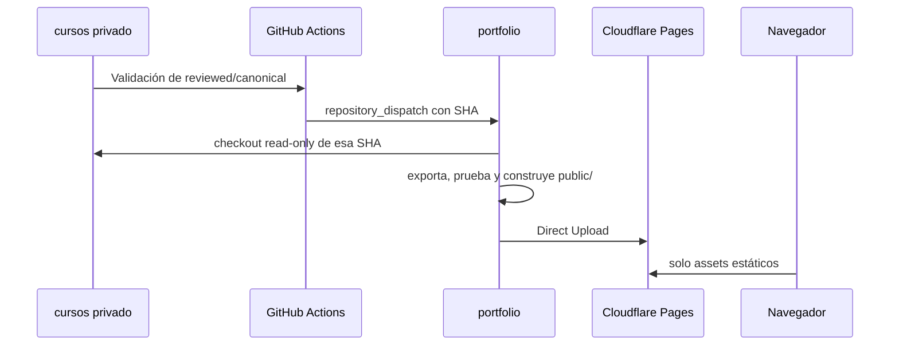

# Despliegue de Ciber Academia sin duplicación de contenido

## Objetivo

`leafar1087/cursos` es la fuente canónica privada de los cursos. `leafar1087/portfolio` conserva la aplicación web y el proceso de despliegue, pero deja de versionar Markdown de cursos cuando la migración queda verificada.

El contenido solo existe de forma temporal dentro del runner de GitHub Actions: se descarga una revisión concreta, se valida, se convierte en estático y se sube a Cloudflare Pages. El navegador recibe `public/`; nunca recibe una credencial ni consulta GitHub en tiempo de ejecución.

## Antes de empezar

- Debes ser propietario o tener permisos de administración en `leafar1087/cursos`, `leafar1087/portfolio` y el proyecto de Cloudflare Pages.
- No pegues tokens en Markdown, commits, terminal compartida, issues ni chats. GitHub solo los muestra una vez.
- Haz la configuración desde una sesión privada y guarda cada token en un gestor de contraseñas antes de introducirlo como secreto.
- Los cursos actuales permanecen temporalmente en `portfolio`. **No los borres todavía.** El primer despliegue desde la fuente privada debe terminar y verificarse antes.

## 1. Crear el token de lectura para `cursos`

Este token lo usa únicamente el workflow del portafolio para leer el repositorio privado durante el build.

1. En GitHub, con `leafar1087`, abre `Settings` → `Developer settings` → `Personal access tokens` → `Fine-grained tokens`.
2. Pulsa `Generate new token`.
3. Nombre sugerido: `portfolio-read-cursos`.
4. Define una expiración corta y renovable; 90 días es una opción razonable si tienes un recordatorio de rotación.
5. En `Resource owner`, selecciona `leafar1087`.
6. En `Repository access`, selecciona **Only select repositories** y marca exclusivamente `cursos`.
7. En `Repository permissions`, asigna solo `Contents: Read-only`. No otorgues Actions, Administration, Issues, Pull requests ni Workflows.
8. Genera y copia el token una única vez.
9. Abre `https://github.com/leafar1087/portfolio/settings/secrets/actions`.
10. Pulsa `New repository secret`, usa el nombre exacto `COURSES_READ_TOKEN`, pega el valor y guarda.

**Comprobación esperada:** el secreto aparece por nombre, sin revelar el valor. El workflow `Deploy academy from private source` podrá hacer checkout de `leafar1087/cursos`; no podrá escribir en él.

## 2. Crear el token de notificación hacia `portfolio`

Este token vive en el repositorio privado y solo solicita al portafolio que despliegue una SHA ya validada.

1. Vuelve a `Fine-grained tokens` y genera otro token; nunca reutilices el anterior.
2. Nombre sugerido: `cursos-dispatch-portfolio`.
3. Define expiración y propietario como en el paso anterior.
4. En `Repository access`, selecciona exclusivamente `portfolio`.
5. En `Repository permissions`, otorga `Contents: Read and write`. El endpoint `repository_dispatch` necesita permiso de escritura sobre el repositorio destino.
6. Genera y copia el token.
7. Abre `https://github.com/leafar1087/cursos/settings/secrets/actions`.
8. Crea el secreto `PORTFOLIO_DISPATCH_TOKEN` con ese valor.

**Comprobación esperada:** un push posterior a `main` que modifique `products/portfolio/**` valida el contenido y emite un evento que incluye la SHA exacta. No se transmite una rama mutable como referencia de despliegue.

## 3. Crear credenciales de Cloudflare Pages

### 3.1 Token de API

1. En Cloudflare, abre el selector de cuenta y ve a `My Profile` → `API Tokens`.
2. Pulsa `Create Token` → `Create Custom Token`.
3. Nombre sugerido: `github-portfolio-pages-deploy`.
4. Añade el permiso de cuenta `Cloudflare Pages: Edit`.
5. Limita el token a la cuenta que contiene el proyecto del portafolio; no añadas permisos DNS, Zone, Workers KV, R2 ni Account Admin si no son necesarios.
6. Crea y copia el token.
7. En `https://github.com/leafar1087/portfolio/settings/secrets/actions`, crea el secreto `CLOUDFLARE_API_TOKEN`.

### 3.2 Account ID y nombre del proyecto

1. En Cloudflare, abre `Workers & Pages` y selecciona el proyecto actual del portafolio.
2. Copia el **Account ID** de la cuenta. Guárdalo como secreto `CLOUDFLARE_ACCOUNT_ID` en `portfolio`.
3. Copia el nombre exacto del proyecto Pages, no el dominio personalizado.
4. En `https://github.com/leafar1087/portfolio/settings/variables/actions`, crea una variable de repositorio llamada `CLOUDFLARE_PAGES_PROJECT` con ese nombre.

El Account ID no concede acceso por sí solo, pero se guarda como secreto para que la configuración de despliegue quede agrupada y no se mezcle con el código.

## 4. Ajustar Cloudflare sin perder el dominio

El proyecto actual está conectado mediante Git integration. El nuevo workflow usa Direct Upload con Wrangler porque necesita construir con contenido privado que no vive en `portfolio`.

1. En Cloudflare Pages, abre el proyecto actual.
2. Ve a `Settings` → `Builds & deployments` o `Build configuration`.
3. Desactiva los despliegues automáticos de ramas de la integración Git. La etiqueta exacta puede variar; el objetivo es que un push a `portfolio/main` no genere un segundo despliegue que compita con GitHub Actions.
4. Conserva el proyecto y el dominio personalizado actuales.
5. No borres el proyecto ni cambies DNS.

Cloudflare permite desplegar manualmente con Wrangler en un proyecto previamente conectado a Git si se desactivan los despliegues automáticos. Si el panel no ofrece esa opción, detente: no crees un proyecto nuevo ni cambies el dominio sin decidirlo explícitamente.

## 5. Probar el primer despliegue manual

Haz esta prueba antes de borrar cualquier copia de cursos en `portfolio`.

1. Abre `https://github.com/leafar1087/portfolio/actions/workflows/deploy-academy.yml`.
2. Pulsa `Run workflow`.
3. En `courses_ref`, introduce `ff63245` o una SHA posterior de `leafar1087/cursos` que contenga Python y Wazuh revisados.
4. Ejecuta el workflow sobre `main`.
5. Abre el log de `Checkout reviewed private courses`: debe resolver la SHA solicitada, no `main` por defecto.
6. Abre el log de `Build academy from the immutable course revision`: debe mostrar exportación correcta, tests, construcción de `public/` y ausencia de campos internos.
7. Abre el paso de Cloudflare: debe terminar con una URL/despliegue exitoso.

### Criterios de aceptación

- La URL pública muestra Python, Wazuh esencial, Wazuh intermedio y Wazuh avanzado en ese orden.
- Cada curso abre su índice y cada módulo abre el Markdown correspondiente.
- En `public/posts/academy/**` no aparecen `artifact_id`, `source_path`, dependencias internas, registros internos ni secretos.
- Un curso `candidate` o `historical` del repositorio privado no aparece en el catálogo.
- GitHub Actions no muestra valores de secretos en ningún log.

## 6. Probar la automatización privada

Después de que el despliegue manual sea correcto:

1. Abre `https://github.com/leafar1087/cursos/actions/workflows/portfolio-publication.yml`.
2. Usa `Run workflow` sobre `main`.
3. Comprueba que la validación termina correctamente.
4. Comprueba que `Request deployment of this reviewed revision` crea un nuevo run de `Deploy academy from private source` en `portfolio`.
5. En el workflow receptor, verifica que `COURSES_REF` coincide con la SHA del run privado.

El despliegue siempre usa una SHA; así, una modificación posterior en `main` no puede cambiar silenciosamente el contenido que se está construyendo.

## 7. Retirar los Markdown duplicados de `portfolio`

Solo después de superar los criterios anteriores:

1. Crea una rama en `portfolio` dedicada a la migración.
2. Elimina exclusivamente `posts/academy/**` y `public/posts/academy/**`.
3. Mantén `posts/` para artículos u otro contenido público que no sea de cursos.
4. No elimines `build_index.py`, `academy-loader.js`, el workflow ni los tests.
5. Ejecuta los tests locales y revisa el diff.
6. Fusiona la rama y observa que el sitio sigue sirviendo el último despliegue directo de Cloudflare.
7. Publica o modifica un módulo `reviewed` en `cursos` y verifica que el siguiente despliegue reconstruye el catálogo desde cero.

Después de esta retirada, el repositorio público ya no contiene los Markdown de cursos. Su única copia versionada será `leafar1087/cursos`.

## Diagnóstico rápido

| Síntoma | Causa probable | Acción segura |
| --- | --- | --- |
| Checkout privado devuelve 404 | Token ausente, expirado o sin acceso a `cursos`. | Revisa `COURSES_READ_TOKEN`; no cambies permisos más allá de Contents: Read. |
| El workflow privado omite la notificación | Falta `PORTFOLIO_DISPATCH_TOKEN`. | Crea el secreto en `cursos`; luego usa `Run workflow` para probar. |
| Dispatch devuelve 401/404 | Token destino sin alcance sobre `portfolio`. | Revoca y recrea el token limitado a `portfolio` con Contents: Write. |
| Wrangler devuelve 403 | Token Cloudflare, Account ID o permiso Pages incorrecto. | Revisa Account → Cloudflare Pages: Edit y la cuenta seleccionada. |
| Hay dos despliegues | Git integration sigue activa. | Desactiva los builds automáticos antes de repetir. |
| El catálogo está vacío | Exportador no encontró `reviewed`/`canonical` o se usó una SHA equivocada. | Lee el log de exportación y verifica el ref, sin promover estados a ciegas. |
| Vuelve a aparecer contenido interno | Se cambió el exportador o el filtro. | Detén el despliegue, revisa el filtro y conserva la evidencia del run. |

## Rotación y revocación

- Rota los tres tokens antes de su expiración y actualiza únicamente el secreto correspondiente.
- Si un token se expone, revócalo desde GitHub o Cloudflare antes de generar uno nuevo.
- Tras una rotación, ejecuta el despliegue manual y confirma que la cadena sigue funcionando.
- Nunca conviertas estos tokens en variables, archivos `.env`, secretos de frontend ni parámetros de URLs.

## Referencias

- [Cloudflare: Direct Upload con CI](https://developers.cloudflare.com/pages/how-to/use-direct-upload-with-continuous-integration/)
- [Cloudflare: integración Git y despliegues directos](https://developers.cloudflare.com/pages/configuration/git-integration/)
- [GitHub: checkout de repositorios privados desde Actions](https://docs.github.com/en/enterprise-server%403.22/actions/reference/workflows-and-actions/workflow-syntax)
