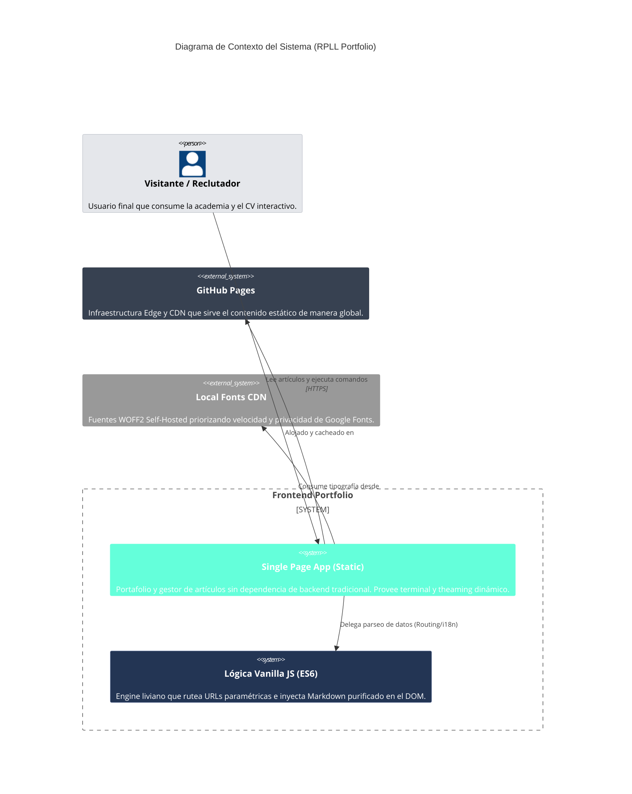

# RPLL Portfolio - Diagrama de Contexto (C4)

Este documento forma parte del Pilar 27 (Documentation-as-Code) de la especificación RPLL v2.2, asegurando que la arquitectura del Portafolio mantenga su descripción directamente en el código fuente.

## C4 Context Model

## Resumen de Arquitectura

El sistema RPLL Portfolio se define como una aplicación **Level 1 (Digital Presence)**. Al carecer de bases de datos relacionales en línea, toda la lógica transaccional delega su estado persistente al LocalStorage (para Theaming) y su distribución a Edges gratuitos (CDN) reduciendo la superficie de ataque casi a cero.
