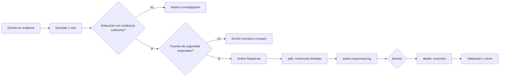

# Respuesta activa controlada: automatizar sin perder el control

Una alerta no es una orden de ejecutar cualquier cosa. Active Response permite que Wazuh ejecute un comando cuando una detección cumple una condición, pero ese privilegio convierte una regla defectuosa en un cambio real sobre un endpoint. La meta no es bloquear más deprisa: es contener un caso bien definido, durante un tiempo limitado, con evidencia de qué ocurrió y una forma comprobada de volver atrás.

## Resultado observable

Al terminar podrás proponer una respuesta activa para un caso concreto, separar detección y acción, probar primero una reacción inocua y verificar sus fases `add` y `delete`. Sabrás por qué una respuesta que bloquea una IP, deshabilita una cuenta o modifica un firewall no debe nacer directamente en producción.

## Seis ideas que evitan incidentes

- La respuesta se dispara **después** de que decoder y rules hayan producido una alerta.
- `local` ejecuta en el agente que originó el evento; `server`, en el manager; `defined-agent`, en un agente concreto. `all` multiplica el impacto y rara vez es un buen primer despliegue.
- Una acción con estado necesita una acción `add`, una acción `delete` y un `<timeout>`; el timeout no arregla una detección mal planteada.
- Una lista de exclusión protege accesos de administración, supervisión y dependencias críticas, pero no sustituye el análisis de contexto.
- Los filtros `level`, `rules_id` y `rules_group` de un mismo bloque son acumulativos: basta uno para disparar. No los uses como si fueran condiciones unidas por AND.
- Un script de ejemplo es una referencia de laboratorio. Revísalo, pruébalo en tu entorno y somételo a revisión antes de autorizarlo en producción.

## Arquitectura y decisión



La alerta y la respuesta no son el mismo control. Una rule puede tener valor para investigar aunque no sea suficientemente fiable para automatizar. Varios fallos de autenticación desde una IP pública pueden justificar una investigación; solo pasarán a bloqueo temporal cuando se haya medido su tasa de falsos positivos, identificado el servicio y protegido el canal de acceso del administrador.

## Antes de configurar: contrato de seguridad

Completa esta tabla para **una** respuesta y un entorno de laboratorio. Si una fila queda sin respuesta, la salida correcta es no automatizar todavía.

| Pregunta | Evidencia que exige | Ejemplo razonable |
| --- | --- | --- |
| ¿Qué evento dispara? | Rule ID, muestras positivas y negativas. | Intentos repetidos contra SSH; no cualquier alerta de nivel alto. |
| ¿Qué cambia? | Recurso, alcance y duración. | Bloqueo temporal de una IP en un endpoint de pruebas. |
| ¿Qué nunca puede tocar? | Exclusiones revisadas. | Bastión, VPN, manager, monitorización, DNS y administración. |
| ¿Quién recupera acceso? | Consola o canal fuera de banda probado. | Acceso local/hipervisor antes de probar firewall. |
| ¿Cómo vuelve atrás? | `delete`, timeout y reversión manual ensayada. | Retirar una marca de laboratorio tras 60 segundos. |
| ¿Cómo se audita? | Alerta, log de respuesta y estado del endpoint. | ID de alerta + `active-responses.log` + estado del recurso. |

No copies redes de ejemplo a una lista real. Las direcciones `192.0.2.0/24` y `198.51.100.0/24` se reservan para documentación; sustitúyelas tras inventariar los flujos legítimos.

## Anatomía de una configuración

Wazuh enlaza un comando con un criterio y un lugar de ejecución. Los comandos incluidos por Wazuh ya tienen su definición; uno propio necesita un bloque `<command>`. El siguiente XML es una **plantilla de laboratorio**, no una orden de activación para un servidor expuesto:

```xml
<!-- /var/ossec/etc/ossec.conf en el manager -->
<ossec_config>
  <command>
    <name>lab-marker</name>
    <executable>lab-marker.py</executable>
    <timeout_allowed>yes</timeout_allowed>
  </command>

  <active-response>
    <disabled>no</disabled>
    <command>lab-marker</command>
    <location>local</location>
    <rules_id>100101</rules_id>
    <timeout>60</timeout>
  </active-response>
</ossec_config>
```

| Campo | Función | Decisión de diseño |
| --- | --- | --- |
| `<command>` | Nombra el ejecutable autorizado. | Identifica una acción concreta, no un script ambiguo. |
| `<timeout_allowed>` | Permite una respuesta reversible. | `yes` solo si el script entiende `delete`. |
| `<location>` | Elige dónde se ejecuta. | Empieza con un agente canario y `local`; evita `all`. |
| `<rules_id>` | Vincula la acción a una detección exacta. | Más seguro que un nivel amplio al aprender. |
| `<timeout>` | Define segundos hasta la reversión. | Corto en laboratorio; ajustado al riesgo en producción. |

El ID `100101` representa una rule local de ejemplo. Sustitúyelo únicamente por una regla que hayas probado con `wazuh-logtest` y telemetría real o sintética controlada. No mezcles `level`, `rules_id` y `rules_group` esperando que se filtren entre sí: Wazuh activa la respuesta si coincide cualquiera de esas opciones.

## Laboratorio seguro: una marca reversible

El primer ensayo no bloquea red, mata procesos ni cambia cuentas. El script recibe el JSON que entrega `wazuh-execd`, deja una marca auditable con `add` y la retira con `delete`. Es una guía mínima para entender el contrato de entrada; pruébala y adáptala en un endpoint desechable antes de cualquier uso real.

Guarda el siguiente ejemplo como `/var/ossec/active-response/bin/lab-marker.py` **solo en un agente de laboratorio**:

```python
#!/usr/bin/env python3
import json
import sys
from pathlib import Path

MARKER = Path("/var/ossec/lab-active-response-marker.txt")
payload = json.loads(sys.stdin.readline())
action = payload.get("command")
alert = payload.get("parameters", {}).get("alert", {})
rule_id = alert.get("rule", {}).get("id", "unknown")

if action == "add":
    MARKER.write_text(f"Active Response de laboratorio; rule={rule_id}\n", encoding="utf-8")
elif action == "delete":
    MARKER.unlink(missing_ok=True)
else:
    raise SystemExit(f"Acción no esperada: {action!r}")
```

El ejemplo no toma decisiones de seguridad ni ejecuta comandos externos. Un script con estado usado de verdad también debe manejar claves de correlación y el protocolo de confirmación de Wazuh para no ejecutar dos veces una acción pendiente; usa la plantilla oficial antes de convertir este ensayo en un script operativo.

Instálalo con permisos restrictivos y confirma que el agente puede leerlo:

```bash
sudo install -o root -g wazuh -m 750 \
  /ruta/del/laboratorio/lab-marker.py \
  /var/ossec/active-response/bin/lab-marker.py
sudo systemctl restart wazuh-agent
sudo ls -l /var/ossec/active-response/bin/lab-marker.py
```

**Qué hace.** Copia el script, fija propietario y permisos, reinicia el agente y muestra el resultado.

**Por qué.** Active Response se ejecuta con privilegios altos; limitar quién modifica el ejecutable es parte del control.

**Resultado esperado.** Un archivo propiedad de `root:wazuh`, modo `750`, y un agente activo.

**Cómo interpretar.** Si el grupo o servicio local difiere, no fuerces estos valores: confirma la instalación y ajusta el procedimiento para ese sistema.

En el manager, añade la plantilla XML, valida la configuración según tu instalación y reinicia de forma controlada:

```bash
sudo /var/ossec/bin/wazuh-analysisd -t
sudo systemctl restart wazuh-manager
sudo journalctl -u wazuh-manager -n 80 --no-pager
```

**Qué hace.** Comprueba el análisis, aplica el cambio y muestra mensajes recientes del manager.

**Por qué.** Una respuesta no sirve si el manager no puede cargar su configuración; el journal aporta contexto si falla.

**Resultado esperado.** Validación satisfactoria, servicio activo y ausencia de errores XML o de comando inexistente.

**Cómo interpretar.** Esto no prueba que el script se ejecute en el endpoint. Ese hecho se demuestra con una alerta de laboratorio y dos evidencias independientes.

## Ejecutar y observar el ensayo

Genera únicamente el evento que corresponde a la rule de laboratorio. Si usas la rule de los módulos de decoders y rules, pásala primero por `wazuh-logtest`; no conviertas un evento de producción en el disparador de la primera prueba.

Mientras generas la señal, observa ambos lados:

```bash
sudo tail -F /var/ossec/logs/active-responses.log
sudo test -e /var/ossec/lab-active-response-marker.txt && \
  sudo cat /var/ossec/lab-active-response-marker.txt
```

Después de la alerta, espera 60 segundos y comprueba que la marca ya no existe:

```bash
sleep 65
sudo test ! -e /var/ossec/lab-active-response-marker.txt \
  && echo 'Reversión observada'
```

El `sleep` solo es aceptable en un laboratorio corto porque hace visible el timeout; en operación usa timestamps de alerta y log, no una espera ciega.

| Momento | Hecho que debes ver | Si no aparece |
| --- | --- | --- |
| Antes | El archivo marcador no existe. | Elimina solo la marca conocida antes de repetir. |
| `add` | Alerta de la rule y marca con su ID. | Revisa rule ID, ruta, permisos y log del agente. |
| Durante | `active-responses.log` registra la ejecución. | No declares éxito por ver solo el dashboard. |
| `delete` | La marca desaparece tras el timeout. | Detén el ensayo y revisa el soporte de `delete`. |

## De la marca al bloqueo temporal de IP

`firewall-drop`, `firewalld-drop`, `host-deny` y las alternativas de Windows son scripts incluidos con Wazuh, pero no son intercambiables ni garantizan el mismo efecto en todos los sistemas. Dependen de plataforma, firewall y versión del agente. Inspecciona primero los scripts disponibles:

```bash
sudo ls -la /var/ossec/active-response/bin/
sudo tail -n 100 /var/ossec/logs/active-responses.log
```

En Windows, consulta el directorio equivalente y el historial de reglas sin crear ni borrar ninguna:

```powershell
Get-ChildItem 'C:\Program Files (x86)\ossec-agent\active-response\bin'
Get-NetFirewallRule -DisplayName 'WAZUH*' -ErrorAction SilentlyContinue |
  Select-Object DisplayName, Enabled, Direction, Action
```

| Control | Pregunta que debe responderse |
| --- | --- |
| Fuente de IP | ¿`srcip` es fiable o procede de proxy/NAT y puede bloquear a muchos usuarios? |
| Exclusiones | ¿Incluye bastión, VPN, manager, monitorización, gateway y administración real? |
| Alcance | ¿Debe ejecutarse en host atacado (`local`) o firewall dedicado (`defined-agent`)? |
| Tiempo | ¿Qué daño produce un bloqueo de 60, 600 o 3600 segundos y quién lo aprueba? |
| Falsos positivos | ¿Se probaron cuentas legítimas, NAT compartido y picos de autenticación? |
| Recuperación | ¿Se ensayó retirar una regla mediante consola fuera de banda? |

Una exclusión se define en el bloque global del manager. Esta forma muestra el mecanismo con valores de documentación, no una política para copiar:

```xml
<ossec_config>
  <global>
    <white_list>192.0.2.10</white_list>
    <white_list>198.51.100.0/24</white_list>
  </global>
</ossec_config>
```

Cada `<white_list>` admite un valor. En producción, el conjunto se construye desde inventario y se revisa después de cambios de red, VPN, bastiones o proxies. Una lista amplia puede inutilizar la contención; una incompleta puede dejar al equipo sin acceso.

## Errores habituales y diagnóstico

| Síntoma | Hecho a recoger | Hipótesis inicial | Acción segura | Qué no concluir |
| --- | --- | --- | --- | --- |
| Hay alerta pero no se ejecuta nada | ID de rule, XML, logs manager/agente. | No coincide o está deshabilitada. | Comparar ID y validar configuración. | Que el script está roto. |
| Se ejecuta `add`, no `delete` | Timestamps, timeout, log y marca. | El script no procesa `delete`. | Detener y revisar contrato. | Que timeout revierte cualquier acción. |
| Se bloquea tráfico legítimo | IP, NAT/proxy, exclusiones, consola. | `srcip` no identifica al atacante real. | Recuperar fuera de banda y desactivar. | Que más timeout lo arregla. |
| Se dispara demasiado | Reglas, grupos y niveles. | Filtros acumulativos o rule amplia. | Rule ID específico y volver al marcador. | Que nivel alto equivale a confianza alta. |
| Agente no ejecuta | Servicio, ruta, permisos, log local. | Instalación o permiso incorrecto. | Corregir canario y repetir. | Que reiniciar el clúster aporta evidencia. |

## Casos de uso: elegir la respuesta correcta

| Situación | Primera respuesta recomendable | Automatización posterior posible |
| --- | --- | --- |
| Diez fallos SSH desde IP pública sin NAT compartido | Investigar y conservar IP/usuario/host. | Bloqueo temporal tras medir errores y exclusiones. |
| Cambio sospechoso en archivo crítico | Preservar hash, usuario, proceso y línea temporal. | Aislamiento solo con playbook y canal de recuperación. |
| Detección de malware por varios controles | Confirmar activo, alcance y falso positivo. | Cuarentena con script revisado, canario y rollback. |
| Cuenta privilegiada anómala | Verificar identidad, sesión y acción. | Deshabilitar solo con autoridad e impacto evaluado. |

El patrón es constante: observar, corroborar, contener con el menor impacto, verificar y recuperar. Active Response acelera una decisión ya diseñada; es peligroso cuando pretende sustituirla.

## Retorno y retirada segura

Para retirar el laboratorio, deshabilita o elimina el bloque `<active-response>` de `lab-marker`, conserva una copia de configuración que cargaba, valida y reinicia de forma controlada. Confirma después que ya no se crean marcas al repetir **solo** la señal de laboratorio. No borres scripts incluidos por Wazuh: elimina únicamente el archivo propio cuya ruta y hash hayas verificado.

Si una respuesta de red corta el acceso, usa el canal fuera de banda previsto. Restaura conectividad con el mecanismo nativo del host, deshabilita la respuesta concreta y conserva los logs de alerta y ejecución antes de volver a probar. El rollback recupera servicio y permite aprender; no debe ocultar el evento.

## Referencias

- [Active Response: conceptos y flujo](https://documentation.wazuh.com/current/user-manual/capabilities/active-response/index.html)
- [Configuración de Active Response](https://documentation.wazuh.com/current/user-manual/capabilities/active-response/how-to-configure.html)
- [Referencia XML de `active-response`](https://documentation.wazuh.com/current/user-manual/reference/ossec-conf/active-response.html)
- [Scripts personalizados y protocolo JSON](https://documentation.wazuh.com/current/user-manual/capabilities/active-response/custom-active-response-scripts.html)
- [Scripts incluidos por plataforma](https://documentation.wazuh.com/current/user-manual/capabilities/active-response/default-active-response-scripts.html)
