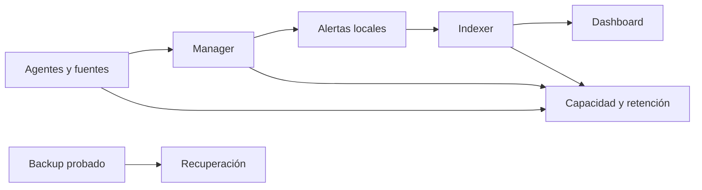

# Operación y recuperación: mantener Wazuh verificable

Una plataforma no está operativa porque el dashboard cargue hoy. Debe conservar ingesta, análisis, almacenamiento, acceso y capacidad dentro de límites conocidos; además debe poder volver a un estado útil después de un cambio o fallo. Una copia sin prueba de restauración es una hipótesis, no una recuperación.

## Resultado observable

Podrás ejecutar un health check de lectura, interpretar cada capa, preparar un cambio con criterios de entrada/salida y definir una prueba de backup y restore sin tratar la retención como una operación de limpieza impulsiva.



## Health check diario de lectura

En un All-in-One de laboratorio, empieza por comprobar cada servicio y no por reiniciarlos todos:

```bash
sudo systemctl is-active wazuh-manager wazuh-indexer wazuh-dashboard filebeat
sudo /var/ossec/bin/agent_control -l
sudo df -h /var/ossec /var/lib/wazuh-indexer 2>/dev/null || df -h
sudo journalctl -u wazuh-manager -n 80 --no-pager
```

**Qué hace.** Lee estado de componentes, agentes, espacio y mensajes recientes del manager.

**Por qué.** Localiza la capa que requiere atención antes de cambiar configuración.

**Resultado esperado.** Servicios activos, agentes coherentes con el alcance, espacio suficiente y ausencia de errores repetitivos relevantes.

**Interpretación.** Un servicio activo no demuestra flujo de alertas; contrasta periódicamente con una marca controlada del módulo de primera alerta. Un agente desconectado puede ser una incidencia de red, identidad o endpoint, no una razón para borrar y enrolar claves sin evidencia.

| Señal | Pregunta operativa | Acción inicial |
| --- | --- | --- |
| Disco crece rápido | ¿Qué índice, archivo o fuente explica el crecimiento? | Medir antes de borrar. |
| Alertas locales sin dashboard | ¿Falló forwarding o indexación? | Conservar ID/marca y revisar Filebeat/indexer. |
| Agentes desconectados | ¿Qué grupo, red o versión comparten? | Segmentar por evidencia. |
| Certificado próximo a caducar | ¿Qué componente y dependencia afectará? | Planificar renovación y retorno. |

## Cambio controlado

Todo cambio de rule, decoder, agente, retención o actualización necesita un contrato mínimo:

| Antes | Durante | Después | Retorno |
| --- | --- | --- | --- |
| Alcance, versión, backup y criterios de éxito. | Un cambio pequeño y observación de logs. | Validación funcional y de salud. | Paso exacto, copia utilizable y responsable. |

Para una rule o decoder: copia, `wazuh-analysisd -t`, pruebas positivas y negativas, reinicio controlado si procede y una alerta real con marca. Para una actualización: lee notas de versión, compatibilidad, capacidad, ventanas y rollback antes de tocar paquetes. No uses una actualización de laboratorio como procedimiento de producción.

## Retención, backup y restore

Retención responde cuánto tiempo debe existir evidencia local e indexada; backup responde cómo recuperarla o recuperar configuración; restore responde si realmente funciona. Son decisiones separadas.

| Activo | Qué proteger | Prueba de recuperación |
| --- | --- | --- |
| Configuración de manager/agentes | Archivos y cambios aprobados. | Restaurar en laboratorio y validar sintaxis. |
| Datos de alertas e índices | Evidencia según obligación y capacidad. | Restaurar un conjunto aislado y consultar un documento conocido. |
| Certificados y secretos | Material de acceso, con almacenamiento seguro. | Verificar acceso controlado sin exponer valores. |
| Reglas/decoders locales | Lógica y muestras de prueba. | `logtest` positivo y negativo tras restaurar. |

Nunca pruebes una restauración sobrescribiendo el entorno que todavía usa el equipo. Usa un destino aislado, define la evidencia que debe reaparecer y documenta la discrepancia si no coincide. Borrar índices para liberar disco es destructivo: primero confirma el objetivo exacto, retención aprobada, copia recuperable y efecto sobre investigaciones.

## Capacidad y una SLO útil

No necesitas inventar objetivos universales. Define pocos indicadores que describan tu servicio: porcentaje de agentes conectados, tiempo desde una marca de prueba hasta su consulta, errores de indexación, espacio libre y éxito de restauración. Cada indicador debe tener fuente, umbral, responsable y acción asociada.

| Indicador | Evidencia | Si degrada |
| --- | --- | --- |
| Agentes conectados | `agent_control` y dashboard. | Agrupar por red, versión o grupo. |
| Latencia de alerta | Marca endpoint → `alerts.json` → dashboard. | Separar ingesta, manager y forwarding. |
| Espacio libre | `df`, tamaños de índices y logs. | Investigar volumen/retención antes de eliminar. |
| Recuperación | Ejercicio aislado de restore. | Corregir backup, procedimiento o permisos. |

## Diagnóstico y cierre

| Síntoma | Hecho a recoger | Error que evitar | Siguiente paso |
| --- | --- | --- | --- |
| Dashboard caído | Estado, puertos y journal del dashboard. | Reiniciar toda la plataforma. | Aislar dashboard, indexer o red. |
| Indexer sin espacio | Índices, crecimiento y retención. | Borrar por patrón amplio. | Aplicar política aprobada y copia verificada. |
| Cambio rompe análisis | Salida de validación y último diff local. | Editar varios XML a la vez. | Restaurar copia y probar un cambio. |
| Restore incompleto | Activo esperado y evidencia ausente. | Declarar éxito por terminar el comando. | Corregir procedimiento y repetir en aislado. |

El cierre operativo es evidencia, no una sensación: health check registrado, cambio validado, alerta trazable y recuperación probada. La siguiente especialización puede ampliar automatización, integraciones o runbooks, pero debe conservar este mismo orden: observar, decidir, cambiar, validar y poder volver atrás.

## Referencias

- [Guía de backup de Wazuh](https://documentation.wazuh.com/current/backup-guide/index.html)
- [Gestión de alertas](https://documentation.wazuh.com/current/user-manual/manager/alert-management.html)
- [Actualización de Wazuh](https://documentation.wazuh.com/current/upgrade-guide/index.html)
