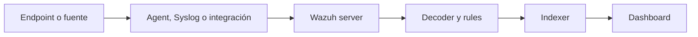
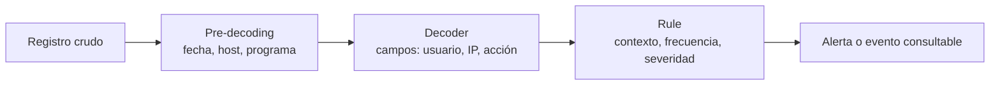

# Arquitectura y alcance de Wazuh

## 1. Resumen ejecutivo

- Wazuh combina capacidades SIEM y XDR para centralizar visibilidad de endpoints, aplicaciones, dispositivos de red y cargas cloud.
- La plataforma tiene un agente opcional en el endpoint y tres componentes centrales: servidor, indexer y dashboard.
- El servidor recibe datos, los procesa con decoders y rules, y genera alertas cuando encuentra coincidencias relevantes.
- El indexer conserva e indexa los datos para búsqueda y análisis; el dashboard es la interfaz para investigar, visualizar y administrar.
- Un dispositivo sin agente también puede aportar telemetría, por ejemplo mediante Syslog o integraciones compatibles.
- El baseline pedagógico del curso es 4.14.7; la documentación y los paquetes oficiales se verificaron en 4.14.8 el 2026-09-26. No son intercambiables sin revisión.

## 2. Objetivo observable

Al terminar, debes poder dibujar el recorrido de una señal desde un endpoint hasta el dashboard, explicar la función de cada componente y detectar qué capa revisar cuando no aparece una alerta.

## 3. Alcance y límite de seguridad

Esta lección describe la arquitectura conceptual. No instala software, no abre puertos y no activa respuestas automáticas. Cualquier cambio en un entorno real debe usar la documentación aplicable a su versión, su topología y sus controles de cambio.

## 4. Conceptos previos

- Telemetría: datos producidos por un endpoint, una aplicación o un dispositivo.
- Evento: registro recibido por la plataforma.
- Decoder: lógica que identifica el tipo de registro y extrae campos útiles.
- Rule: lógica que compara un evento decodificado con un patrón de detección.
- Alerta: resultado de una rule que coincide y merece investigación o respuesta.

## 5. Diagrama funcional

Endpoint o fuente sin agente
  ↓
Wazuh agent, Syslog o integración
  ↓
Wazuh server: recepción, decoders y rules
  ↓
Filebeat
  ↓
Wazuh indexer: indexación y almacenamiento
  ↓
Wazuh dashboard: consulta, visualización y gestión


## Mapa visual de la plataforma



| Si falla aquí | Empieza comprobando |
| --- | --- |
| La fuente no aparece | Producción del log y recolección |
| No hay alerta | Decoder, fields y rule |
| No se ve en pantalla | Indexación y consulta |

## 6. Componentes y responsabilidades

| Componente | Responsabilidad | Pregunta operativa |
| --- | --- | --- |
| Wazuh agent | Recolecta y reenvía datos de un endpoint supervisado. | ¿El endpoint está enviando telemetría? |
| Wazuh server | Analiza datos de agentes y fuentes sin agente; aplica decoders y rules. | ¿El evento fue recibido y evaluado? |
| Wazuh indexer | Indexa y almacena alertas y datos para búsqueda. | ¿El resultado llegó y se puede consultar? |
| Wazuh dashboard | Presenta datos, permite investigar y administrar la plataforma. | ¿El analista puede ver e interpretar el resultado? |

El servidor también administra agentes y puede escalar horizontalmente como clúster. El dashboard no sustituye al análisis: si una fuente no entrega datos o una rule no coincide, una pantalla accesible puede seguir mostrando cero resultados.

## 7. Qué ocurre dentro de cada capa

La tabla anterior sirve para orientarse. Para operar la plataforma hay que distinguir además entre **producir**, **transportar**, **analizar**, **guardar** y **consultar** datos. Son responsabilidades diferentes y cada una deja una evidencia distinta.

| Capa | Trabajo interno relevante | Evidencia que deja | Error de interpretación habitual |
| --- | --- | --- | --- |
| Endpoint y agente | Lee registros, informa de cambios de integridad, inventaría software y aplica la configuración recibida. | Log local, servicio del agente y `ossec.log`. | “El agente está activo, luego todos los datos del host llegan”. |
| Manager | Recibe, identifica formato, extrae campos, evalúa rules y administra el ciclo de agentes. | Eventos recibidos, `ossec.log` y alertas locales cuando una rule coincide. | “Todo lo recibido debe convertirse en alerta”. |
| Indexer | Conserva documentos para búsqueda y agregación. | Índices, documentos y salud de almacenamiento. | “El indexer detecta un ataque”. |
| Dashboard | Consulta datos, presenta agentes y ofrece herramientas de análisis. | Búsquedas, filtros y visualizaciones. | “Si no aparece en pantalla, el evento no existe”. |

En un manager verás procesos especializados: recepción de agentes, análisis, base de datos interna, API y módulos. No hace falta memorizar cada daemon en esta lección, pero sí saber que un servicio `wazuh-manager` activo puede tener un problema interno de recepción, análisis o módulo. Los módulos de agentes y de troubleshooting bajarán a ese nivel de detalle.

### Telemetría no es un único tipo de dato

El agente no se limita a “enviar logs”. Puede aportar evidencias con ritmos y significados distintos:

| Familia | Ejemplo | Pregunta que permite responder | Precaución |
| --- | --- | --- | --- |
| Logs de autenticación | SSH, `sudo`, Windows Security. | ¿Quién intentó o consiguió acceso? | Sin hora, usuario u origen la investigación queda incompleta. |
| Logs de aplicación | NGINX, API, base de datos. | ¿Qué petición o error afectó al servicio? | Un código HTTP no explica por sí solo la causa. |
| Integridad de archivos | Cambio en una configuración o binario. | ¿Qué cambió respecto a la línea base? | Cambio detectado no equivale a cambio malicioso. |
| Inventario | Paquetes, procesos, puertos y hotfixes. | ¿Qué software y exposición tiene este host? | Inventario no es prueba de ejecución ni de compromiso. |
| Fuentes sin agente | Syslog de firewall, router o dispositivo. | ¿La red permitió, bloqueó o encaminó un flujo? | El dispositivo debe incluir origen, destino, acción y tiempo útiles. |

El curso dedicará un módulo a cada una de estas familias cuando se conviertan en configuración o detección. Aquí la idea importante es que cada evidencia responde una pregunta diferente; no existe una fuente universal que cuente toda la historia.

## 8. Del registro crudo al dato que usa un analista

Un evento de texto no es todavía un dato útil para correlación. El análisis pasa por tres niveles. Este recorrido explica por qué una rule no debe escribirse antes de observar una muestra real.



Considera esta línea de un laboratorio:

```text
Oct 12 10:15:30 ubuntu-lab-01 sshd[2048]: Failed password for invalid user alumno from 198.51.100.99 port 54321 ssh2
```

| Etapa | Lo que Wazuh intenta obtener | Por qué importa después |
| --- | --- | --- |
| Pre-decoding | Hora, host y programa `sshd`. | Delimita dónde y cuándo ocurrió. |
| Decoder | Usuario, IP origen y puerto. | Permite buscar por identidad u origen sin depender del texto exacto. |
| Rule | Si el patrón merece una alerta y con qué contexto. | Define qué llega a una cola de investigación. |

La misma línea puede ser un evento valioso aunque no termine en alerta. Por ejemplo, puede completar una línea temporal o demostrar que una regla nueva no está extrayendo el campo que necesita. Los módulos 05 y 06 enseñarán a probar decoders y rules sin adivinar.

## 9. Wazuh según el problema que quieres resolver

Los nombres SIEM, HIDS y XDR ayudan cuando describen una necesidad concreta; como etiquetas de producto aclaran poco. La misma instalación puede empezar protegiendo un servidor y acabar integrando señales de identidad, red y cloud, pero cada etapa exige más operación.

| Necesidad | Uso razonable de Wazuh | Lo que todavía no resuelve |
| --- | --- | --- |
| Saber si cambia un archivo sensible en un servidor | HIDS: agente, FIM y contexto del host. | Si el cambio estaba autorizado o es malicioso. |
| Investigar autenticaciones, errores y actividad entre varios equipos | SIEM: recolección de fuentes, búsqueda y reglas. | La calidad de los logs que nadie decidió recoger. |
| Relacionar endpoint, red e identidad y ejecutar una respuesta | XDR: integraciones, detecciones validadas y respuesta acotada. | Un proceso de respuesta, propietarios y criterio humano. |

La progresión útil no es activar todas las capacidades. Empieza por una pregunta que el equipo pueda responder: “¿quién modificó esta configuración?”, “¿desde qué IP falló el acceso?” o “¿qué equipos siguen expuestos después de un parche?”. Añade fuentes y automatización cuando ya seas capaz de explicar la evidencia que producen.

## 10. Recorrido de una señal

1. Un endpoint genera un registro, por ejemplo un evento de autenticación.
2. El agente lo recolecta y lo envía al servidor; una fuente sin agente puede enviar Syslog.
3. El servidor identifica el formato, extrae campos y evalúa rules.
4. Si una rule coincide, el servidor genera una alerta.
5. Filebeat reenvía datos de alerta y evento al indexer mediante TLS.
6. El dashboard consulta el indexer y muestra el resultado al analista.

No todos los registros generan una alerta. La ausencia de alerta no prueba por sí sola que no haya actividad: puede indicar que la fuente, la recolección, el decodificado, las rules o la consulta no cubren el caso.

## 11. Ejemplo resuelto de laboratorio

Un servidor Linux de laboratorio con dirección 192.0.2.10 registra un intento de autenticación. El agente reenvía la señal al servidor Wazuh. Si el decoder reconoce el formato y una rule aplicable coincide, el resultado se guarda en el indexer y aparece en el dashboard.

Interpretación:

- Si el evento no llega al servidor, investiga agente, conectividad y recolección.
- Si llega pero no genera alerta, investiga decoder, fields y rule.
- Si existe alerta pero no aparece en el dashboard, investiga el envío al indexer y la consulta.

## 12. Práctica: seguir una señal de extremo a extremo

> Escenario de laboratorio basado en práctica operativa. No es una regla oficial ni una configuración para copiar en producción.

En un endpoint Linux aislado que ya recoja Syslog, genera una marca reconocible:

```bash
logger -t sshd "Failed password for invalid user alumno from 198.51.100.99 port 54321 ssh2"
```

El comando no ataca nada ni intenta abrir una sesión: solo escribe una línea de prueba en el registro local. Busca después esa marca, primero en el log del endpoint y luego en Wazuh. Si no llega al dashboard, no saltes directamente a las rules. Sigue esta secuencia:

| Evidencia ausente | Primera capa que revisar | Pregunta útil |
| --- | --- | --- |
| La línea no está en el log local | Servicio o ruta de log | ¿El sistema escribió realmente el evento? |
| Está en el host, pero no en Wazuh | Agente, `localfile` o red | ¿El agente lee esa ruta y puede comunicarse? |
| Llega como evento, sin alerta | Decoder y rule | ¿El formato produjo los campos que espera la detección? |
| Existe alerta, pero no se ve | Indexación o filtro temporal | ¿Busco el host, la hora y el campo correctos? |

El texto de una alerta, su identificador y su nivel dependen de las rules instaladas. El objetivo de esta práctica no es prometer una alerta concreta; es aprender a demostrar, con evidencia, dónde se interrumpe la cadena.

## 13. Validaciones independientes

Antes de afirmar que la plataforma cubre una fuente, comprueba por separado:

1. El endpoint o dispositivo produce el registro esperado.
2. Wazuh lo recibe.
3. El registro se decodifica con los campos esperados.
4. La rule prevista coincide o se documenta por qué no debe coincidir.
5. La alerta o el evento indexado se puede recuperar desde el dashboard.

## 14. Errores frecuentes

- Confundir el dashboard con el motor de detección.
- Asumir que instalar un agente equivale a recolectar todos los logs del host.
- Interpretar cero alertas como ausencia de actividad adversa.
- Usar una guía de otra patch release sin revisar el canal de instalación.
- Desplegar una topología de laboratorio como si fuera una configuración de alta disponibilidad.

## 15. Troubleshooting inicial

| Síntoma | Hipótesis | Verificación | Acción | Escalación |
| --- | --- | --- | --- | --- |
| No hay datos de un endpoint | El agente o la fuente no envía telemetría. | Revisa estado, conectividad y registros del origen. | Corregir la fuente antes de tocar rules. | Operación de endpoint o red. |
| Hay evento sin alerta | Decoder o rule no cubre el caso. | Examina el evento y el resultado del análisis. | Ajustar contenido de detección bajo control de cambios. | Detection engineering. |
| Hay alerta sin resultados en dashboard | El dato no se indexó o la consulta no lo encuentra. | Comprueba indexer, flujo de envío y filtros. | Corregir la capa afectada. | Operación de plataforma. |

## 16. Hechos, supuestos e hipótesis

Hechos verificados: la arquitectura usa agente, servidor, indexer y dashboard; el servidor analiza con decoders y rules; el indexer almacena datos para consulta.

Supuesto del ejemplo: el endpoint de laboratorio está enrolado y tiene conectividad con el servidor.

Hipótesis a comprobar: una rule concreta detectará el evento generado. Esta hipótesis requiere prueba en el entorno objetivo.

## 17. Caso de uso: construir una línea temporal sin inventar conclusiones

Un analista recibe una alerta de autenticación fallida desde `198.51.100.42` contra `ubuntu-lab-01`. La alerta es un punto de partida, no la historia completa. El siguiente cuadro muestra cómo ampliar el contexto sin confundir correlación con causalidad:

| Fuente | Qué buscar | Qué puede aportar | Qué todavía no prueba |
| --- | --- | --- | --- |
| Host Linux | Fallos y accesos posteriores de la misma cuenta u origen. | Secuencia local de autenticación y privilegios. | Que la IP pertenezca a un atacante. |
| Aplicación web | `401`, `403` o errores desde el mismo origen. | Si el origen tocó otro servicio. | Que ambas acciones estén coordinadas. |
| Firewall | Acción, destino y puerto del flujo. | Si la red permitió llegar al host. | Qué proceso recibió la conexión. |
| Identidad | Inicio de sesión, MFA o cambios de cuenta. | Si la cuenta tuvo actividad coherente con el evento. | Que un fallo aislado sea compromiso. |

La investigación madura responde primero “qué sabemos” y “qué falta”. Solo después decide si debe escalarse, contenerse o cerrarse como actividad esperada. Esta forma de trabajar se desarrolla en los módulos de casos de uso, hunting y dashboard.

## 18. Ejercicio

Dibuja la ruta de una señal de SSH desde 198.51.100.25 hacia un servidor de laboratorio. Para cada flecha, escribe una evidencia que te permitiría confirmar el paso. Después indica qué capa revisarías primero si el dashboard no muestra el resultado.

## 19. Rollback y riesgo residual

No hay cambios técnicos que revertir. El riesgo residual es tomar la arquitectura conceptual como diseño de producción. Para producción, valida dimensionamiento, red, identidad, retención, alta disponibilidad y versión contra las fuentes oficiales vigentes.

## 20. Referencias oficiales

- [Componentes de Wazuh](https://documentation.wazuh.com/current/getting-started/components/index.html)
- [Arquitectura de Wazuh](https://documentation.wazuh.com/current/getting-started/architecture.html)
- [Wazuh server](https://documentation.wazuh.com/current/getting-started/components/wazuh-server.html)
- [Wazuh dashboard](https://documentation.wazuh.com/current/getting-started/components/wazuh-dashboard.html)
- [Cómo funciona la recolección y el análisis de logs](https://documentation.wazuh.com/current/user-manual/capabilities/log-data-collection/how-it-works.html)
