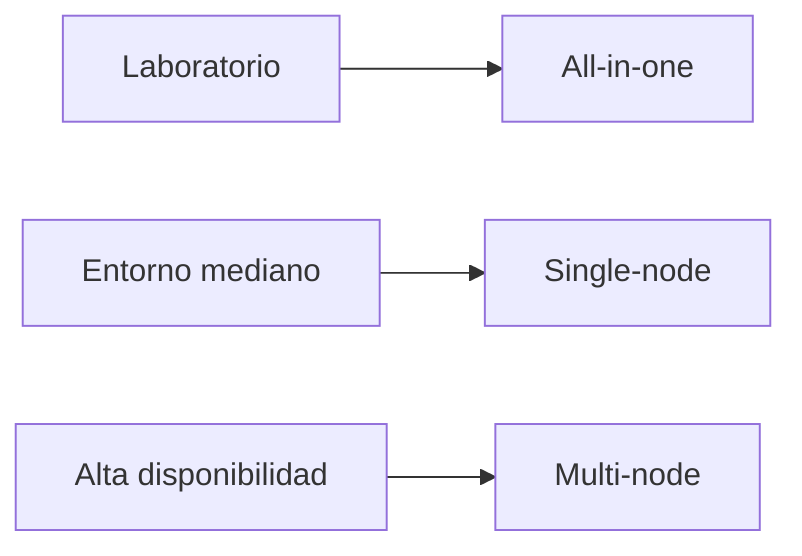
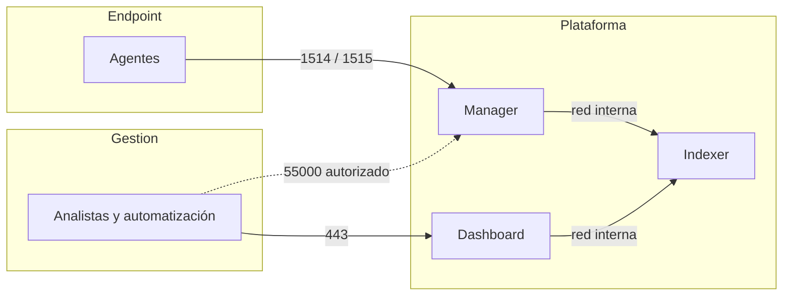

# Topologías de despliegue

Una instalación de Wazuh no empieza eligiendo comandos: empieza eligiendo qué problema se quiere resolver. Un laboratorio necesita aprender el flujo completo con el menor número de piezas. Una organización mediana necesita repartir carga. Una plataforma que no puede detenerse necesita diseñar tolerancia al fallo. La misma tecnología admite los tres escenarios, pero no son intercambiables.

## Elegir sin improvisar

**All-in-one** instala servidor, indexer y dashboard en una sola máquina. Es la puerta de entrada correcta para un laboratorio o un entorno pequeño: hay menos red que depurar, menos certificados que administrar y un recorrido fácil de seguir cuando se está aprendiendo.

**Single-node** separa los componentes centrales en hosts distintos. Tiene sentido cuando un único host ya no ofrece margen suficiente o cuando se quiere aislar almacenamiento, análisis e interfaz. Esa separación añade responsabilidad: red, DNS, certificados, observabilidad y recuperación dejan de ser detalles secundarios.

**Multi-node** distribuye servidor e indexer en clústeres y mantiene el dashboard como capa de acceso. Es la opción para alto volumen de eventos, tolerancia a fallos y alta disponibilidad. No es una mejora cosmética: exige diseño de capacidad, balanceo, almacenamiento y procedimientos de operación.


## Comparador rápido

| Topología | Úsala cuando | Coste operativo |
| --- | --- | --- |
| All-in-one | Aprendes o tienes un entorno pequeño | Bajo |
| Single-node | Necesitas separar componentes y capacidad | Medio |
| Multi-node | Requieres volumen, tolerancia a fallos o alta disponibilidad | Alto |



**Ejemplo:** no saltes de laboratorio a clúster por estética. Elige multi-node solo si puedes operar sus nodos, certificados, capacidad y recuperación.

## El tamaño real: eventos, retención y consultas

Contar agentes es una aproximación pobre. Un portátil con pocos registros puede emitir mucho menos que un controlador de dominio, un servidor web muy activo o un firewall. Para decidir recursos hay que observar tres variables que se multiplican entre sí:

| Variable | Pregunta de diseño | Consecuencia si se ignora |
| --- | --- | --- |
| EPS medio y picos | ¿Cuántos eventos por segundo llegan normalmente y durante una ráfaga? | Colas, latencia de análisis o pérdida de visibilidad. |
| Retención | ¿Cuántos días debe poder investigarse un evento? | El índice llena disco o la evidencia desaparece antes de tiempo. |
| Patrón de consulta | ¿Cuántas personas y dashboards consultan a la vez? | Dashboard lento aunque la ingesta parezca sana. |

Un cálculo inicial no sustituye una medición, pero evita adivinar:

```text
eventos por día = EPS medio × 86 400
almacenamiento estimado = eventos por día × tamaño medio del documento × días de retención
```

Añade réplicas, margen de crecimiento y espacio operativo antes de comprar disco. La cifra de tamaño por documento se mide en tu propia muestra: depende de qué fuentes, campos y alertas indexes. Este curso no fijará una cifra universal porque convertiría un laboratorio pequeño en una falsa promesa de capacidad.

## Diseño de red: quién necesita hablar con quién

No todos los puertos deben estar disponibles para todos los equipos. Una instalación segura empieza dibujando los flujos y autorizando solo los necesarios.

| Origen | Destino | Servicio | Propósito | Exposición recomendada |
| --- | --- | --- | --- | --- |
| Agente | Manager | 1514/TCP | Telemetría continua. | Desde subredes de endpoints autorizadas. |
| Agente nuevo | Manager | 1515/TCP | Enrolamiento automático, si se usa. | Temporal o restringido a redes de alta. |
| Analista | Dashboard | 443/TCP | Consulta y administración web. | Red de gestión o acceso con identidad fuerte. |
| Manager/Dashboard | Indexer | 9200/TCP | Indexación y consulta entre componentes. | Red interna de plataforma, no endpoints. |
| Nodos de clúster | Nodos de su rol | Puertos de clúster aplicables. | Replicación y coordinación. | Solo entre nodos del clúster. |
| Automatización autorizada | API del manager | 55000/TCP | Administración mediante API. | Red de gestión; nunca exposición pública genérica. |



El diagrama no abre firewalls. Su función es que la regla de red se pueda revisar antes de instalar. El módulo de laboratorio comprobará después que el socket, la ruta y el servicio coinciden con este diseño.

## Arquitectura de laboratorio reproducible

Para aprender con señales heterogéneas, una topología pequeña pero completa basta:

| Host de documentación | Rol | Señal inicial |
| --- | --- | --- |
| `wazuh-lab.example.test` | Manager, indexer y dashboard. | Recibe e indexa. |
| `ubuntu-lab-01.example.test` | Agente Linux. | Autenticación, `sudo` y logs de aplicación. |
| `win-lab-01.example.test` | Agente Windows. | Eventos de Windows y una fuente elegida. |

Usa una red aislada o una VLAN de laboratorio, nombres que no pertenezcan a producción y snapshots antes de cambios de configuración. No necesitas una máquina de emulación adversaria para aprender el flujo de datos; se añade más adelante, cuando ya sepas validar qué evidencia produce cada prueba.

## Ficha de decisión antes de tocar el instalador

Completa esta ficha. Si una respuesta es “no sé”, es una tarea de diseño, no un detalle que el instalador resolverá.

| Decisión | Respuesta del laboratorio | Evidencia que la respalda |
| --- | --- | --- |
| Objetivo | Ver agentes Linux y Windows, una fuente por sistema y una alerta validada. | Lista de ejercicios y fuentes. |
| Topología | All-in-One. | Volumen bajo, un operador y sin requisito de continuidad. |
| Nombre/red | FQDN estable y segmento aislado. | DNS o reserva DHCP y diagrama de flujos. |
| Canal/versión | Paquetes oficiales 4.14.x o Docker, no ambos mezclados. | URL de documentación y versión anotada. |
| Retorno | Snapshot previo y copia de la configuración cambiada. | Identificador de snapshot y ubicación de la copia. |
| Responsable | Una persona con acceso al host y a la red de laboratorio. | Propietario del entorno. |

Esta ficha parece sencilla, pero evita errores caros: instalar con una IP que cambia, abrir el indexer a toda la red o no saber cómo repetir el ejercicio una semana después.

## La decisión que evita problemas después

Antes de desplegar, responde cuatro preguntas:

1. ¿Cuántos endpoints y qué volumen de eventos esperas?
2. ¿Qué interrupción es aceptable?
3. ¿Quién operará certificados, actualizaciones y copias de seguridad?
4. ¿Es un laboratorio reproducible o una plataforma que protege un servicio real?

Si no hay respuestas claras, empieza por all-in-one en un laboratorio aislado. Es más honesto que construir un clúster que nadie podrá mantener.

## Compatibilidad de versiones

Los componentes centrales deben usar exactamente la misma versión, incluido el parche. En la revisión del 2026-09-26, los paquetes oficiales tenían 4.14.8 disponible; el canal Docker mostraba 4.14.7 estable y 4.14.8 como release candidate. La etiqueta 4.14.x no autoriza a mezclar imágenes, paquetes y ejemplos sin comprobar su canal.

Piensa en la versión como un contrato entre componentes. Si el servidor, el indexer y el dashboard no comparten ese contrato, el fallo puede aparecer como una instalación correcta que después no indexa, no consulta o no actualiza bien.

## Caso de decisión

Un equipo con veinte equipos de prueba y sin requisito de continuidad debería elegir all-in-one. Un SOC interno que necesita separar almacenamiento y análisis puede evaluar single-node. Una organización con picos altos de eventos y requisito de continuidad necesita analizar multi-node, pero solo después de documentar capacidad, recuperación y operación diaria.

## Comprobaciones antes de instalar

- Define el canal: paquetes o Docker.
- Fija la misma versión para todos los componentes centrales.
- Documenta nombres, red y certificados antes de abrir el instalador.
- Declara dónde se almacenarán los datos y cómo se recuperarán.
- Prueba el diseño con fuentes sintéticas antes de incorporar endpoints reales.

### Inventario técnico de solo lectura

En el host candidato, estas comprobaciones no cambian el sistema y dan una fotografía útil antes de instalar:

```bash
hostnamectl
free -h
df -h /
lsblk -o NAME,SIZE,TYPE,FSTYPE,MOUNTPOINTS
ip -brief address
```

`hostnamectl` y `ip -brief address` confirman identidad y conectividad local. `free`, `df` y `lsblk` muestran recursos disponibles, no la capacidad final garantizada. Conserva la salida junto con la ficha de decisión: permitirá explicar después por qué el laboratorio funcionaba o dónde empezó a quedarse corto.

## Práctica: aceptación mínima de un laboratorio

> Práctica de operación para un laboratorio ya instalado. Es deliberadamente de solo lectura: no sustituye la guía oficial de instalación ni modifica servicios.

Antes de enrolar equipos reales, comprueba que las piezas que elegiste están vivas y que los puertos previstos pertenecen al proceso correcto:

```bash
sudo systemctl is-active wazuh-manager wazuh-indexer wazuh-dashboard
sudo ss -tulpn | grep -E ':(1514|1515|55000|9200|443)\\b'
```

El primer comando debería devolver `active` para los servicios instalados. El segundo no demuestra que todo funcione: muestra qué proceso escucha cada puerto en ese host. Contrasta el resultado con tu topología; no todos los puertos deben estar expuestos desde todas las redes.

| Resultado | Lectura prudente | Siguiente comprobación |
| --- | --- | --- |
| Un servicio no está activo | Hay un problema local antes de hablar de agentes. | Revisa el log del servicio y la guía de la misma versión. |
| Un puerto escucha en una interfaz inesperada | Puede haber una exposición o una configuración distinta a la prevista. | Compara red, firewall y diagrama de despliegue. |
| Los servicios están activos, pero el dashboard falla | La salud del proceso no prueba el flujo completo. | Verifica certificados, indexación y acceso según la guía oficial. |

Guarda hora, host y versión junto con el resultado. Esa evidencia vale más que una captura sin contexto cuando debas comparar dos despliegues.

## Errores que se repiten

El más frecuente es llamar producción a un laboratorio. El siguiente es actualizar solo un componente porque una nueva versión apareció en un canal. También es común asumir que un clúster elimina la necesidad de backups o de monitorización. Ninguna topología sustituye esas prácticas.

## Límite y siguiente paso

Esta lección no es una receta de instalación. Sirve para elegir una topología defendible. Cuando tengas esa decisión, continúa con agentes y telemetría: son los que determinan si el diseño produce evidencia útil.

## Referencias

- [Arquitectura de Wazuh](https://documentation.wazuh.com/current/getting-started/architecture.html)
- [Guía de instalación](https://documentation.wazuh.com/current/installation-guide/index.html)
