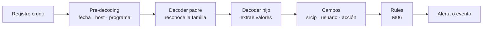

# Decoders: convertir registros en campos

Un log no se vuelve útil porque aparezca en Wazuh. Primero tiene que conservar una estructura que permita responder preguntas. Un decoder reconoce esa estructura y transforma partes del texto en campos: usuario, IP de origen, puerto, acción o valores propios de una aplicación. Es el puente entre un registro crudo y una detección que puede explicarse.

En este módulo no se escriben rules. El resultado buscado es más básico y más importante: demostrar, con una muestra, que los campos que una rule necesitará existen y contienen el valor correcto.

## Resultado observable

Al terminar podrás tomar una línea real de un endpoint, probarla con `wazuh-logtest`, interpretar las tres fases de salida y decidir con evidencia si basta un decoder incluido o si hace falta uno local. También crearás y revertirás un decoder de laboratorio sin tocar los archivos que entrega Wazuh.

## Antes de empezar

Necesitas un manager operativo de los módulos anteriores y una muestra de log sin datos personales, tokens ni secretos. Trabaja primero en un manager de laboratorio o en una ventana de cambio. Un error en un decoder local puede hacer que el análisis no cargue; por eso se valida antes de reiniciar el servicio.

Conviene llegar aquí después de [Recolección y procesamiento de logs](04-recoleccion-de-logs.md). Allí se comprueba que la fuente genera y entrega datos. Aquí se comprueba qué significan esos datos para Wazuh.

## Del texto a un evento consultable



Un decoder no decide si algo es malicioso. Tampoco corrige una fuente que no llega al manager. Su trabajo es interpretar. Las rules usarán después el nombre del decoder y los campos extraídos para clasificar, correlacionar o alertar.

| Pieza | Pregunta que responde | Ejemplo de resultado |
| --- | --- | --- |
| Pre-decoding | ¿Quién emitió el registro y cuándo? | `program_name: sshd` |
| Decoder | ¿Qué formato concreto es este? | `name: sshd` |
| Campo normalizado | ¿Qué dato puede usar otra detección? | `srcip: 198.51.100.44` |
| Campo dinámico | ¿Qué contexto propio debo conservar? | `data.request_id: req-7f3` |
| Rule | ¿Debe generar una alerta? | Se aborda en M06. |

### Escoger bien los campos

No extraigas todo solo porque existe. Extrae lo que cambia una decisión de investigación. Un nombre semántico reutilizable facilita reglas y búsquedas; el resto puede mantenerse como campo dinámico bajo `data.`.

| Si el log contiene | Campo que suele representar mejor el dato | Uso posterior |
| --- | --- | --- |
| IP del cliente | `srcip` | Agrupar intentos por origen. |
| IP del servicio alcanzado | `dstip` | Distinguir el activo afectado. |
| Cuenta que inicia sesión | `srcuser` o `user` según el sentido | Relacionar identidad y actividad. |
| Puerto origen/destino | `srcport` / `dstport` | Entender una comunicación de red. |
| Resultado de una operación | `status` o `action` | Separar éxito, fallo o bloqueo. |
| Identificador de negocio | `data.request_id`, `data.amount` | Correlacionar con la aplicación sin inventar semántica. |

Evita asignar `srcip` a una IP de proxy si el registro no distingue proxy y cliente. En ese caso conserva ambos valores, por ejemplo `srcip` para el cliente validado y `data.proxy_ip` para el salto intermedio. Una extracción aparentemente correcta, pero semánticamente errónea, genera conclusiones erróneas a gran escala.

## La primera prueba: un decoder ya incluido

Antes de escribir XML, pregunta al sistema qué hace con la muestra. `wazuh-logtest` prueba el mismo conjunto de decoders y rules que usa el análisis de Wazuh, pero en una sesión aislada. Esto permite fallar de forma segura y repetir ensayos sin enviar eventos falsos al índice.

En el manager, abre la herramienta:

```bash
sudo /var/ossec/bin/wazuh-logtest
```

**Qué hace.** Abre una sesión interactiva de prueba de decoders y rules.

**Por qué se usa aquí.** Muestra si el log fue interpretado y qué campos quedaron disponibles antes de modificar configuración.

**Resultado esperado.** La herramienta queda esperando una línea de log. Sale con `Ctrl+C`.

**Cómo interpretarlo.** No ha cambiado la configuración ni ha creado una alerta de producción; solo está preparada para evaluar muestras.

Pega una muestra de laboratorio con IP reservada para documentación:

```text
Oct 15 21:07:00 linux-lab-01 sshd[29205]: Invalid user alumno from 198.51.100.44 port 48928
```

En una instalación con el ruleset estándar, la salida debe mostrar tres fases similares a estas:

```text
**Phase 1: Completed pre-decoding.
  hostname: 'linux-lab-01'
  program_name: 'sshd'

**Phase 2: Completed decoding.
  name: 'sshd'
  srcip: '198.51.100.44'
  srcport: '48928'
  srcuser: 'alumno'

**Phase 3: Completed filtering (rules).
  id: '5710'
  level: '5'
```

Los identificadores y la descripción de la fase 3 dependen de la versión y del ruleset instalado. Para este módulo, el criterio es la fase 2: debe reconocer `sshd` y extraer `srcip`, `srcport` y `srcuser`. El número de rule no es una prueba de que la extracción sea correcta por sí solo.

### Pruebas que impiden engañarse

Una única coincidencia puede ocultar un decoder demasiado permisivo. Prueba una muestra positiva, una negativa y una incompleta.

| Muestra | Resultado correcto | Qué descubre |
| --- | --- | --- |
| `Invalid user alumno from 198.51.100.44 port 48928` | Extrae usuario, IP y puerto. | Caso previsto. |
| Un log de `cron` o de otra aplicación | No debe aparecer como `sshd`. | Coincidencia excesivamente amplia. |
| `Invalid user alumno from 198.51.100.44` | Puede no extraer puerto; no debe inventarlo. | Suposiciones del patrón. |

Guarda las muestras saneadas junto con el cambio de configuración. Una prueba repetible vale más que una captura de pantalla que no se puede reproducir.

## Cuándo crear un decoder local

Los decoders incluidos ya cubren muchos formatos conocidos. Buscar primero evita duplicar mantenimiento. En el manager puedes inspeccionar el ruleset instalado sin editarlo:

```bash
sudo grep -Rni --include='*.xml' 'nombre-de-tu-aplicacion' /var/ossec/ruleset/decoders
```

**Qué hace.** Busca el nombre de la aplicación en los XML de decoders que entrega Wazuh.

**Por qué se usa.** Permite descubrir si ya hay una familia de decoder que conviene aprovechar.

**Resultado esperado.** Rutas y líneas coincidentes, o ninguna coincidencia.

**Cómo interpretarlo.** Una coincidencia es un punto de lectura, no permiso para editar el archivo. Los archivos bajo `/var/ossec/ruleset/` pertenecen al producto y pueden cambiar en una actualización. Los decoders propios viven en `/var/ossec/etc/decoders/`.

Crea uno local cuando se cumplan estas tres condiciones:

1. La fuente llega al manager y hay una muestra representativa.
2. El decoder incluido no extrae los campos necesarios o el formato es propio.
3. Puedes definir qué campos usarán una investigación o una rule posterior.

No crees un decoder para “probar si sale una alerta”. Primero demuestra la interpretación; la decisión de alertar pertenece al siguiente módulo.

## Laboratorio: decoder para una aplicación de autenticación

Una aplicación interna escribe esta línea con una cabecera Syslog convencional:

```text
Sep 28 14:31:17 api-lab-01 auth-service[4120]: LOGIN_FAILED user=alumno src=198.51.100.44 request_id=req-7f3
```

El equipo de respuesta necesita saber quién falló, desde qué IP y qué petición de aplicación revisar. La secuencia es: reconocer `auth-service`, extraer esos valores y probarlos. No se añade ninguna rule todavía.

### 1. Hacer una copia recuperable

Si ya existe el archivo local, realiza una copia antes de editarlo:

```bash
sudo cp -a /var/ossec/etc/decoders/local_decoder.xml /var/ossec/etc/decoders/local_decoder.xml.before-auth-lab
```

**Qué hace.** Conserva permisos, propietario y contenido del archivo local antes del laboratorio.

**Por qué se usa.** Permite volver exactamente al estado anterior si el XML no valida o el patrón captura más de lo debido.

**Resultado esperado.** Aparece el archivo terminado en `.before-auth-lab`.

**Cómo interpretarlo.** La copia no aplica ningún cambio. Si el archivo no existe, revisa el contenido de `/var/ossec/etc/decoders/` y crea el archivo según la estructura XML que use tu instalación, en lugar de copiar a ciegas.

### 2. Definir padre e hijo

Añade estos decoders dentro del contenedor XML existente de `local_decoder.xml`:

```xml
<decoder name="academy-auth-service">
  <program_name>^auth-service$</program_name>
</decoder>

<decoder name="academy-auth-login-failed">
  <parent>academy-auth-service</parent>
  <prematch>^LOGIN_FAILED </prematch>
  <regex offset="after_prematch">user=(\S+) src=(\S+) request_id=(\S+)</regex>
  <order>srcuser,srcip,data.request_id</order>
</decoder>
```

El padre limita el trabajo a eventos cuyo programa sea `auth-service`. El hijo solo trata fallos de inicio de sesión y alinea sus tres grupos de captura, de izquierda a derecha, con los tres elementos de `order`. El `offset="after_prematch"` comienza la expresión después de `LOGIN_FAILED `; evita volver a recorrer texto que ya se comprobó.

La expresión de ejemplo presupone valores sin espacios. Si el formato real permite espacios, comillas o valores opcionales, no la “arregles” adivinando: recopila muestras de cada variante y diseña pruebas para ellas.

### 3. Validar la sintaxis antes de cargarla

```bash
sudo /var/ossec/bin/wazuh-analysisd -t
```

**Qué hace.** Comprueba que la configuración y el ruleset pueden cargarse.

**Por qué se usa.** Detecta XML mal cerrado, nombres duplicados y otros errores antes de afectar al proceso de análisis.

**Resultado esperado.** Una confirmación de configuración verificada y código de salida cero.

**Cómo interpretarlo.** La sintaxis es aceptable; aún falta probar que la extracción es semánticamente correcta.

### 4. Probar el caso, el borde y el negativo

Ejecuta de nuevo `wazuh-logtest` y pega la muestra completa. En la fase 2 espera algo equivalente a:

```text
name: 'academy-auth-service'
srcuser: 'alumno'
srcip: '198.51.100.44'
data.request_id: 'req-7f3'
```

Después prueba estas dos líneas en la misma sesión:

```text
Sep 28 14:31:18 api-lab-01 auth-service[4120]: LOGIN_OK user=alumno src=198.51.100.44 request_id=req-7f4
Sep 28 14:31:19 api-lab-01 other-service[4120]: LOGIN_FAILED user=alumno src=198.51.100.44 request_id=req-7f5
```

No deben activar el decoder hijo `academy-auth-login-failed`. Esta parte del laboratorio es tan importante como el caso que sí coincide: demuestra que el contexto de aplicación y la acción no se están mezclando.

### 5. Cargar el cambio de forma controlada

Solo después de que la sintaxis y las tres muestras sean correctas, carga el cambio en el manager:

```bash
sudo systemctl restart wazuh-manager
sudo systemctl is-active wazuh-manager
```

**Qué hace.** Reinicia el manager y consulta su estado.

**Por qué se usa.** El proceso de análisis necesita cargar la definición local en memoria.

**Resultado esperado.** `active`.

**Cómo interpretarlo.** El servicio está en ejecución, no que el decoder sea correcto. Repite una muestra controlada y revisa el evento procesado antes de declarar el cambio listo.

## JSON: no conviertas en regex lo que ya tiene estructura

Si el contenido relevante es JSON válido, Wazuh dispone de un decoder JSON. Para un servicio con cabecera Syslog y cuerpo JSON, un decoder local puede delegar la parte estructurada:

```xml
<decoder name="academy-oauth-json">
  <program_name>^oauth-service$</program_name>
  <plugin_decoder>JSON_Decoder</plugin_decoder>
</decoder>
```

Una muestra útil para probarlo es:

```text
Sep 28 15:02:01 api-lab-01 oauth-service[5088]: {"event":"token_validation","user_id":"u_9921","src_ip":"203.0.113.45","result":"failure"}
```

Comprueba en la fase 2 los campos que genere tu versión. Si una rule necesita nombres normalizados como `srcip`, documenta la decisión de mapeo y pruébala; no des por hecho que toda clave JSON se convertirá automáticamente a un campo canónico. Para JSON por línea que el agente ya recoge con `log_format` `json`, empieza probando la salida real antes de añadir cualquier decoder personalizado.

## Diagnóstico: encontrar la fase que falla

| Síntoma | Hecho que debes comprobar | Causa frecuente | Corrección segura | Validación final |
| --- | --- | --- | --- | --- |
| No aparece la fase 1 esperada | La muestra conserva su cabecera original. | Se pegó un log truncado o alterado. | Recuperar una muestra saneada, pero completa. | Host y programa son coherentes. |
| Hay fase 1, pero no campos en fase 2 | El padre o el `prematch` coincide. | Espacio, mayúscula o formato distinto. | Comparar carácter por carácter y añadir una prueba de variante. | Campos y valores correctos. |
| Los campos están desplazados | Número y orden de capturas. | Un grupo de regex falta o es demasiado amplio. | Alinear cada `()` con un elemento de `order`. | Cada campo contiene solo su valor. |
| Un log ajeno activa el decoder | Prueba negativa con otro programa. | Padre demasiado genérico. | Anclar `program_name` o hacer el `prematch` específico. | La muestra negativa no coincide. |
| Funciona en `logtest`, no en vivo | Archivo local cargado y fuente recolectada. | Falta reinicio o el log nunca llegó. | Validar, reiniciar de forma controlada y volver a M04 para la ingesta. | Evento real con los mismos campos. |

No confundas una hipótesis con un hecho. “El regex parece bien” es una hipótesis. “La fase 2 muestra `srcip: 198.51.100.44` para esta muestra” es un hecho verificable. La evidencia útil incluye la línea de entrada, el XML exacto, la salida de prueba y la versión del manager.

## Cierre y retorno

Si la validación falla o una prueba negativa coincide, vuelve al archivo anterior:

```bash
sudo cp -a /var/ossec/etc/decoders/local_decoder.xml.before-auth-lab /var/ossec/etc/decoders/local_decoder.xml
sudo /var/ossec/bin/wazuh-analysisd -t
sudo systemctl restart wazuh-manager
```

No borres la copia hasta que la reversión haya validado y el servicio esté activo. Después, conserva fuera del manager las muestras saneadas y el XML aprobado como evidencia reproducible.

El siguiente paso será Rules y `wazuh-logtest`: usar de forma explícita el decoder y los campos verificados para escribir una detección mínima, probar su comportamiento y evitar falsos positivos previsibles.

## Referencias

- [Sintaxis de decoders — documentación de Wazuh](https://documentation.wazuh.com/current/user-manual/ruleset/ruleset-xml-syntax/decoders.html)
- [Pruebas de decoders y rules con `wazuh-logtest` — documentación de Wazuh](https://documentation.wazuh.com/current/user-manual/ruleset/testing.html)
- Material de laboratorio y ejemplos propios, saneados para su publicación.
