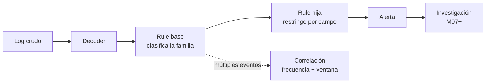

# Rules y `wazuh-logtest`: convertir campos en una detección

Una rule no es una frase alarmante escrita en XML. Es una afirmación comprobable: para un evento que ya fue interpretado, estas condiciones concretas justifican esta severidad y esta acción de investigación. Si no puedes enseñar la muestra que la activa y otra que no debe activarla, todavía no tienes una detección lista.

Este módulo enlaza con [Decoders: convertir registros en campos](11-decoders.md). Allí verificamos que `auth-service` entrega `srcuser`, `srcip` y `data.request_id`. Ahora usaremos esos campos para crear una detección mínima y, sobre todo, para demostrar dónde deja de aplicar.

## Resultado observable

Al finalizar tendrás una rule local que eleva un fallo de autenticación de la cuenta administrativa de laboratorio, una batería de pruebas positiva y negativa en `wazuh-logtest`, evidencia de sintaxis válida y una ruta de retorno. También sabrás por qué una regla individual no equivale a una correlación ni a una respuesta automática.

## El árbol de decisión



La rule base identifica una familia de eventos. La hija añade el criterio que hace que el caso merezca atención. Esto reduce duplicación: si el formato cambia, se revisa primero el decoder; si cambia el riesgo de una identidad concreta, se ajusta la regla hija sin reescribir todo el árbol.

| Elemento | Función | Error habitual |
| --- | --- | --- |
| `decoded_as` | Limita la rule a un decoder concreto. | Aplicar un `match` amplio a cualquier Syslog. |
| `if_sid` | Hace que una rule hija dependa de una rule anterior. | Referenciar un ID que no se probó. |
| `field` | Compara un campo ya extraído. | Usar un campo que el decoder no produce. |
| `level` | Prioriza el evento en Wazuh; no mide “peligro real” por sí solo. | Elegir 12 porque “suena crítico”. |
| `group` | Añade clasificación para búsqueda y tratamiento posterior. | Usarlo como sustituto de la lógica de detección. |
| `mitre` | Documenta una técnica que la evidencia respalda. | Etiquetar MITRE por parecido, sin justificarlo. |

## Antes de editar: diseña el contrato de la detección

Para el laboratorio, el hecho que queremos detectar es acotado: **un fallo de autenticación de la cuenta `admin` en la aplicación `auth-service`**. No afirmamos que sea un incidente confirmado. Es una señal que debe conservar el usuario, la IP de origen y el identificador de petición para que un analista pueda decidir.

| Pregunta | Decisión de laboratorio |
| --- | --- |
| Fuente | `auth-service`, interpretado por `academy-auth-service`. |
| Condición base | La línea contiene `LOGIN_FAILED`. |
| Condición adicional | `srcuser` es exactamente `admin`. |
| Evidencia que se conserva | `srcip`, `srcuser` y `data.request_id`. |
| Severidad inicial | 5: requiere revisión, no automatización. |
| Caso que no debe alertar | El mismo fallo para una cuenta no administrativa. |
| Límite | Un solo fallo no demuestra fuerza bruta ni compromiso. |

Esta ficha evita una práctica dañina: escribir una rule, verla disparar una vez y decidir que está “terminada”. El objetivo, los falsos positivos conocidos y el límite de la señal forman parte de la detección.

## Dónde viven las rules y cómo elegir un ID

Los archivos distribuidos están bajo `/var/ossec/ruleset/rules/`. No se editan: una actualización puede reemplazarlos. Para cambios pequeños usa `/var/ossec/etc/rules/local_rules.xml`; para una colección mayor, crea archivos XML propios bajo `/var/ossec/etc/rules/` y mantenlos con el mismo rigor que código.

Wazuh reserva `100000`–`120000` para rules personalizadas. No basta con elegir un número de ese rango: debe estar libre en tu manager. Compruébalo antes de copiar el ejemplo:

```bash
sudo grep -Rnw --include='*.xml' -e 'id="100100"' /var/ossec/etc/rules /var/ossec/ruleset/rules
```

**Qué hace.** Busca el ID elegido tanto en rules locales como en las distribuidas.

**Por qué se usa.** Dos definiciones con el mismo ID convierten la revisión y la carga en un problema difícil de diagnosticar.

**Resultado esperado.** Ninguna línea si `100100` está disponible.

**Cómo interpretarlo.** Si hay salida, elige otro ID libre dentro del rango y cambia de forma coherente las referencias `if_sid` del ejemplo. El ID es un identificador técnico; la descripción y las pruebas explican su significado.

## Laboratorio: de decoder verificado a rule hija

Partimos de esta muestra, coherente con el decoder del módulo anterior:

```text
Sep 28 14:31:17 api-lab-01 auth-service[4120]: LOGIN_FAILED user=admin src=198.51.100.44 request_id=req-7f3
```

Primero vuelve a probarla con `wazuh-logtest`. No edites rules si la fase 2 no muestra al menos `srcuser: 'admin'` y `srcip: '198.51.100.44'`. Una rule no puede recuperar un campo que no fue decodificado.

### 1. Crear una copia antes del cambio

```bash
sudo cp -a /var/ossec/etc/rules/local_rules.xml /var/ossec/etc/rules/local_rules.xml.before-auth-rule-lab
```

**Qué hace.** Genera una copia recuperable del archivo de rules locales, preservando sus atributos.

**Por qué se usa.** El retorno debe ser un procedimiento conocido, no una reconstrucción manual bajo presión.

**Resultado esperado.** Existe el archivo terminado en `.before-auth-rule-lab`.

**Cómo interpretarlo.** Todavía no se ha cargado ni modificado una detección. Si el archivo no existe, inspecciona la estructura de `/var/ossec/etc/rules/` y crea un XML válido según tu instalación antes de añadir reglas.

### 2. Definir una base y una hija

Dentro del contenedor XML existente de `local_rules.xml`, añade el grupo. Sustituye los IDs si el paso anterior mostró que están ocupados.

```xml
<group name="academy,authentication,">
  <rule id="100100" level="0">
    <decoded_as>academy-auth-service</decoded_as>
    <match>^LOGIN_FAILED</match>
    <description>Academy auth: failed login event</description>
  </rule>

  <rule id="100101" level="5">
    <if_sid>100100</if_sid>
    <field name="srcuser">^admin$</field>
    <description>Academy auth: failed login for administrative account from $(srcip), request $(data.request_id)</description>
    <group>authentication_failed,</group>
  </rule>
</group>
```

La primera rule es una clasificación silenciosa: `level="0"` no pretende alertar, sino dar una raíz explícita a esta familia de logs. La segunda hereda con `if_sid`, exige el usuario exacto y crea la señal que se investigará. No uses `overwrite="yes"` aquí: ese atributo sirve para reemplazar una rule existente y requiere revisar cuidadosamente la definición original y el impacto.

El `match` se aplica al contenido del evento; el `field` se aplica al valor ya decodificado. Separarlos mantiene la intención legible: primero es un fallo de login de esta aplicación; después afecta a una cuenta administrativa.

### 3. Validar antes de cargar

```bash
sudo /var/ossec/bin/wazuh-analysisd -t
```

**Qué hace.** Verifica que Wazuh puede cargar la configuración, decoders y rules disponibles.

**Por qué se usa.** Detecta XML mal formado, IDs incorrectos y referencias problemáticas antes de reiniciar el manager.

**Resultado esperado.** Confirmación de configuración válida y código de salida cero.

**Cómo interpretarlo.** La estructura se puede cargar. Aún no prueba que las condiciones implementen el caso de uso correcto.

### 4. Ejecutar la batería de pruebas

Abre una sola sesión para que las pruebas sean comparables:

```bash
sudo /var/ossec/bin/wazuh-logtest
```

Pega cada una de estas muestras, una línea por vez:

| Caso | Entrada | Resultado que debes exigir |
| --- | --- | --- |
| Positivo | `Sep 28 14:31:17 api-lab-01 auth-service[4120]: LOGIN_FAILED user=admin src=198.51.100.44 request_id=req-7f3` | Rule `100101`, nivel 5, usuario e IP correctos. |
| Negativo funcional | `Sep 28 14:31:18 api-lab-01 auth-service[4120]: LOGIN_FAILED user=alumno src=198.51.100.44 request_id=req-7f4` | No debe alcanzar `100101`; puede quedar en la base nivel 0. |
| Negativo de acción | `Sep 28 14:31:19 api-lab-01 auth-service[4120]: LOGIN_OK user=admin src=198.51.100.44 request_id=req-7f5` | No debe alcanzar `100100` ni `100101`. |
| Negativo de emisor | `Sep 28 14:31:20 api-lab-01 other-service[4120]: LOGIN_FAILED user=admin src=198.51.100.44 request_id=req-7f6` | No debe alcanzar las rules del laboratorio. |

Para el caso positivo, una salida resumida esperada es:

```text
**Phase 2: Completed decoding.
  name: 'academy-auth-service'
  srcuser: 'admin'
  srcip: '198.51.100.44'
  data.request_id: 'req-7f3'

**Phase 3: Completed filtering (rules).
  id: '100101'
  level: '5'
```

Un resultado positivo sin negativos no es suficiente. La prueba negativa de acción protege contra el caso más costoso: generar alertas por accesos correctos de una cuenta administrativa. La prueba de emisor protege contra una expresión reutilizada accidentalmente por otra aplicación.

### 5. Cargar la detección y comprobar el servicio

`wazuh-logtest` puede ver los archivos guardados para probarlos; para que el análisis de producción genere alertas con el cambio, reinicia el manager en una ventana adecuada:

```bash
sudo systemctl restart wazuh-manager
sudo systemctl is-active wazuh-manager
```

**Qué hace.** Carga el ruleset en el servicio y consulta su estado.

**Por qué se usa.** Una prueba aislada no cambia el proceso que recibe telemetría real.

**Resultado esperado.** `active`.

**Cómo interpretarlo.** El manager está disponible. Genera después un evento de laboratorio controlado o espera una fuente autorizada y comprueba la alerta con sus campos; no declares éxito solo por el estado del servicio.

## Severidad, correlación y MITRE: tres cosas distintas

Un `level` ordena la atención en Wazuh, pero no sustituye el contexto. Un fallo aislado de `admin` puede ser un error humano, una contraseña desactualizada o un intento hostil. Por eso este laboratorio usa nivel 5 y no activa una respuesta.

La correlación requiere una condición temporal adicional. Por ejemplo, una rule hija futura podría contar varios eventos de la base durante una ventana y exigir que compartan `srcip`:

```xml
<rule id="100102" level="10" frequency="8" timeframe="120">
  <if_matched_sid>100100</if_matched_sid>
  <same_srcip />
  <description>Academy auth: repeated failed logins from $(srcip)</description>
</rule>
```

No la actives todavía como parte del laboratorio básico. Antes hay que decidir si ocho intentos en dos minutos son anómalos para esa aplicación, probar la secuencia completa y estudiar los casos de proxy, NAT y pruebas de carga. Además, la rule usada con `if_matched_sid` debe tener nivel al menos 1; las rules de nivel 0 se descartan para esa correlación. Esa diferencia evita una configuración que parece lógica, pero nunca acumula eventos.

MITRE ATT&CK tampoco es un adorno. Añade una técnica solo cuando el comportamiento observado y la intención de la rule la sustentan. El mapeo, la cobertura y los huecos se trabajan en el módulo siguiente; aquí el requisito es que el evento y los campos sean correctos.

## Diagnóstico y errores frecuentes

| Síntoma | Evidencia a revisar | Causa probable | Corrección | Prueba de cierre |
| --- | --- | --- | --- | --- |
| La rule hija no dispara | Fase 2 y el `if_sid` de fase 3. | El campo o el padre no coincide. | Corregir primero decoder, campo o ID; no subir el nivel. | Positivo alcanza solo la hija prevista. |
| La rule dispara en `LOGIN_OK` | Muestra negativa de acción. | `match` demasiado amplio o ausente. | Anclar la acción esperada y repetir todos los casos. | `LOGIN_OK` no alcanza la base. |
| Se producen alertas de muchas aplicaciones | `program_name` y nombre del decoder. | Regla basada solo en texto genérico. | Usar `decoded_as` y una prueba de emisor ajeno. | El emisor ajeno no coincide. |
| El manager no inicia | Salida de `wazuh-analysisd -t` y journal del servicio. | XML mal cerrado, ID duplicado o referencia inválida. | Restaurar copia, validar y aplicar un cambio por vez. | Servicio activo y pruebas repetidas. |
| La correlación no cuenta | Nivel de la rule base y sesión de prueba. | Base en nivel 0 o pruebas aisladas. | Usar base nivel 1+ con `no_log` si corresponde y probar la secuencia. | Contador y alerta de correlación esperados. |

## Hechos, hipótesis y límite operativo

| Afirmación | Estado |
| --- | --- |
| La muestra fue decodificada como `academy-auth-service` y contiene `srcuser=admin`. | Hecho, si aparece en fase 2. |
| La rule `100101` clasifica ese caso con nivel 5. | Hecho, si aparece en fase 3. |
| La IP `198.51.100.44` corresponde a un atacante. | Hipótesis: requiere contexto de red, identidad y otros eventos. |
| Un fallo de `admin` justifica bloquear una IP. | Hipótesis no demostrada; no hay active response en este módulo. |

La detección debe conservar lo que sabe y dejar visible lo que todavía no sabe. Ese hábito reduce la escalada injustificada y facilita que otra persona revise tu razonamiento.

## Retorno

Si el XML no valida, las pruebas negativas fallan o el servicio queda inactivo, restaura la copia antes de seguir afinando:

```bash
sudo cp -a /var/ossec/etc/rules/local_rules.xml.before-auth-rule-lab /var/ossec/etc/rules/local_rules.xml
sudo /var/ossec/bin/wazuh-analysisd -t
sudo systemctl restart wazuh-manager
sudo systemctl is-active wazuh-manager
```

No elimines el respaldo hasta haber confirmado que la configuración restaurada valida, el manager está activo y las rules de laboratorio ya no aparecen en `wazuh-logtest`.

El siguiente módulo transforma esta prueba en una primera alerta de extremo a extremo: genera un evento autorizado, confirma su análisis y lo localiza en el dashboard sin confundir la señal con una conclusión de incidente.

## Referencias

- [Rules personalizadas — documentación de Wazuh](https://documentation.wazuh.com/current/user-manual/ruleset/rules/custom.html)
- [Sintaxis de rules — documentación de Wazuh](https://documentation.wazuh.com/current/user-manual/ruleset/ruleset-xml-syntax/rules.html)
- [Pruebas de decoders y rules con `wazuh-logtest` — documentación de Wazuh](https://documentation.wazuh.com/current/user-manual/ruleset/testing.html)
- Ejemplos de laboratorio y casos de ingeniería de detección, saneados para publicación.
