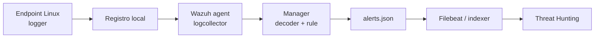

# Primera alerta end-to-end: de una señal controlada al dashboard

Una rule que pasa `wazuh-logtest` todavía no prueba que la plataforma esté lista. Falta recorrer el trayecto real: endpoint, agente, manager, alerta local, indexer y dashboard. Este laboratorio lo comprueba con una única señal inocua, generada en un endpoint autorizado.

No se simula un ataque ni se toca una cuenta real. El mensaje se apoya en el decoder y la rule creados en [Decoders](11-decoders.md) y [Rules](12-rules-y-logtest.md).

## Resultado observable

Podrás generar un evento con una marca única, demostrar que coincide con la rule local prevista, encontrarlo en `alerts.json` y localizarlo en Threat Hunting por ID de rule y marca. Si falla, sabrás en qué capa investigar.

## La cadena de evidencia



Cada flecha es una prueba distinta. Una alerta presente en `alerts.json` pero ausente del dashboard es un problema de envío, indexación o consulta; no se corrige editando una rule.

## Preparación

Anota y adapta los valores siguientes. Si cambiaste los IDs de ejemplo en M06, usa los tuyos de manera consistente.

| Dato | Ejemplo | Finalidad |
| --- | --- | --- |
| Endpoint | `linux-lab-01` | Agente Linux enrolado. |
| Programa | `auth-service` | Debe coincidir con el decoder local. |
| Rule de alerta | `100101` | ID de la rule hija de M06. |
| Marca | `req-e2e-20260928-01` | Distingue esta ejecución de las anteriores. |
| Usuario | `admin` | Cuenta ficticia de laboratorio, no una credencial real. |

En el manager conserva los dos valores de la ejecución en variables temporales:

```bash
RULE_ID=100101
TRACE_ID=req-e2e-20260928-01
```

**Qué hace.** Guarda el ID y la marca solo en la shell actual.

**Por qué.** Las consultas posteriores no mezclarán resultados de otros laboratorios.

**Resultado esperado.** No imprime salida ni modifica Wazuh.

**Interpretación.** Cambia los dos valores si tu entorno usa otros; desaparecerán al cerrar la terminal.

## Comprobación previa: la línea debe alertar

En el manager abre `wazuh-logtest`:

```bash
sudo /var/ossec/bin/wazuh-logtest
```

Pega la misma forma de evento que se producirá en el endpoint:

```text
Sep 28 14:31:17 linux-lab-01 auth-service[4120]: LOGIN_FAILED user=admin src=198.51.100.44 request_id=req-e2e-20260928-01
```

La fase 2 debe mostrar `academy-auth-service`, `srcuser: 'admin'`, `srcip: '198.51.100.44'` y `data.request_id`. La fase 3 debe mostrar tu `RULE_ID` con nivel 5. Si falla aquí, detente: enviar el mismo mensaje por el agente no arreglará el decoder ni la rule.

## Procedimiento

### 1. Confirmar que el endpoint escribe la fuente

En el endpoint Linux verifica el agente, escribe una prueba negativa inocua y léela desde el journal:

```bash
sudo systemctl is-active wazuh-agent
logger -t auth-service 'SOURCE_CHECK request_id=req-e2e-20260928-01'
journalctl -t auth-service -n 5 --no-pager
```

**Qué hace.** Comprueba el agente, genera una marca local y muestra las últimas entradas del programa.

**Por qué.** Ningún agente puede recoger una línea que el sistema de logging no escribió.

**Resultado esperado.** `active` y una entrada `SOURCE_CHECK` con la marca.

**Interpretación.** Esta línea no debe alertar porque no contiene `LOGIN_FAILED`. Si solo existe en el journal, confirma en M04 que el agente recolecta `journald`; si llega a un archivo Syslog, comprueba la entrada `localfile` de su ruta. La ruta varía entre distribuciones.

### 2. Generar la señal autorizada

En ese mismo endpoint de laboratorio, ejecuta una única vez:

```bash
logger -p authpriv.notice -t auth-service 'LOGIN_FAILED user=admin src=198.51.100.44 request_id=req-e2e-20260928-01'
```

**Qué hace.** Escribe un mensaje Syslog local con el programa, la acción y los campos esperados por los módulos anteriores.

**Por qué.** Prueba la ruta completa sin probar contraseñas, crear cuentas ni modificar un servicio de negocio.

**Resultado esperado.** Normalmente no hay salida en consola; la evidencia está en los logs.

**Interpretación.** La ausencia de texto no es un fallo. Busca la marca única:

```bash
journalctl -t auth-service --since '5 minutes ago' --no-pager | grep 'req-e2e-20260928-01'
```

Si tu distribución lo enruta a un archivo, usa la ruta validada en M04, por ejemplo:

```bash
sudo grep 'req-e2e-20260928-01' /var/log/syslog | tail -n 1
```

La línea debe contener programa, usuario, IP y `request_id`. Si falta un campo, el registro real no cumple el contrato que validaste en `wazuh-logtest`.

### 3. Verificar la alerta en el manager

En el manager sigue el archivo de alertas. Una rule de nivel 5 supera el umbral de almacenamiento predeterminado, que es nivel 3:

```bash
sudo tail -F /var/ossec/logs/alerts/alerts.json | jq -c --arg id "$RULE_ID" --arg trace "$TRACE_ID" 'select(.rule.id == $id and .data.request_id == $trace)'
```

**Qué hace.** Muestra exclusivamente el documento de alerta que coincide con ID y marca.

**Por qué.** `alerts.json` separa el análisis correcto del manager de los problemas posteriores de indexación o dashboard.

**Resultado esperado.** Un JSON con `rule.id`, `rule.level`, `agent.name`, `data.srcip` y `data.request_id`. Pulsa `Ctrl+C` al verlo.

**Interpretación.** Si aparece, el decoder y la rule procesaron telemetría real. No repitas el evento muchas veces si no aparece: usa la matriz de diagnóstico.

Si el manager tiene habilitados archivos de archivo, comprueba opcionalmente el registro crudo:

```bash
sudo grep 'req-e2e-20260928-01' /var/ossec/logs/archives/archives.json | tail -n 1
```

Que un registro esté en archivo pero no en alertas significa “ingesta sí, detección no”. No significa que la red esté rota.

### 4. Encontrar la alerta en el dashboard

Abre **Threat Hunting**, selecciona una ventana temporal corta que cubra la prueba y filtra por el ID:

```text
rule.id:100101
```

Después añade la marca:

```text
data.request_id:req-e2e-20260928-01
```

Adapta ambos valores a tu entorno. Empieza por la condición más selectiva y añade el nombre del agente si hay más de un resultado.

Al abrir el documento verifica esta cadena:

| Campo | Valor esperado | Qué prueba |
| --- | --- | --- |
| `rule.id` | Tu ID local | La detección concreta. |
| `rule.level` | `5` | Que no acabó en la rule base silenciosa. |
| `agent.name` | Endpoint de laboratorio | Atribución correcta. |
| `data.srcip` | `198.51.100.44` | Extracción del decoder. |
| `data.request_id` | Marca única | Unir endpoint, manager e indexer. |
| Hora | Coherente con la ejecución | Reloj y filtro temporal. |

Conserva la consulta, la muestra saneada y el resultado de campos. Una captura complementa esa evidencia, pero no permite repetirla por sí sola.

## Diagnóstico por capa

| Observación | Capa confirmada | Causa probable | Siguiente paso |
| --- | --- | --- | --- |
| No hay marca local | Ninguna | `logger`, prioridad o logging local. | Repetir paso 2 y confirmar ruta. |
| Está local, no hay alerta | Generación | `localfile`, agente, conectividad, decoder o rule. | Confirmar configuración efectiva y repetir `logtest`. |
| Está en archivo, no en alertas | Ingesta | Nivel 0, umbral o condiciones de rule. | Copiar `full_log` a `logtest` y revisar fases 2/3. |
| Está en `alerts.json`, no en dashboard | Análisis | Filebeat, indexer, retraso o filtro. | Revisar forwarding y buscar ID + marca. |
| Aparece con otro ID | Análisis parcial | Rule anterior o XML distinto. | Revisar fase 3 y rules locales. |
| Aparecen muchas alertas | Señal demasiado amplia | Match o emisor no restringido. | Ejecutar negativos de M06 y revertir si procede. |

Cuando esté en `alerts.json` pero no en el dashboard, revisa primero el estado de componentes sin modificar nada:

```bash
sudo systemctl is-active wazuh-manager filebeat wazuh-indexer wazuh-dashboard
sudo journalctl -u filebeat -n 80 --no-pager
```

Un servicio activo no prueba que haya indexado este documento, pero un servicio inactivo sí delimita la causa. Evita reiniciar todos los componentes por reflejo: conserva el evento y revisa primero el error de forwarding o indexación.

## Hechos, hipótesis y retorno

| Afirmación | Estado | Evidencia mínima |
| --- | --- | --- |
| El endpoint generó la señal. | Hecho | Marca local. |
| El manager produjo una alerta. | Hecho | Documento en `alerts.json`. |
| El dashboard la muestra. | Hecho | Consulta reproducible y documento. |
| La IP de ejemplo es hostil. | Falso | Es una IP reservada para documentación. |
| La alerta demuestra un incidente. | Hipótesis | Requiere investigación adicional. |

`logger` no deja configuración que deba revertirse. Para retirar el decoder y la rule de laboratorio, usa las copias de M05/M06, valida y reinicia:

```bash
sudo cp -a /var/ossec/etc/decoders/local_decoder.xml.before-auth-lab /var/ossec/etc/decoders/local_decoder.xml
sudo cp -a /var/ossec/etc/rules/local_rules.xml.before-auth-rule-lab /var/ossec/etc/rules/local_rules.xml
sudo /var/ossec/bin/wazuh-analysisd -t
sudo systemctl restart wazuh-manager
```

No borres copias hasta confirmar validación y servicio activo. Los eventos ya indexados son evidencia histórica: su retención es una decisión operativa, no un paso de rollback.

## Referencias

- [Gestión de alertas — Wazuh](https://documentation.wazuh.com/current/user-manual/manager/alert-management.html)
- [Umbral de alertas en `ossec.conf` — Wazuh](https://documentation.wazuh.com/current/user-manual/reference/ossec-conf/alerts.html)
- [Recolección y análisis de logs — Wazuh](https://documentation.wazuh.com/current/user-manual/capabilities/log-data-collection/how-it-works.html)
- [Navegación del dashboard — Wazuh](https://documentation.wazuh.com/current/user-manual/wazuh-dashboard/navigating-the-wazuh-dashboard.html)
