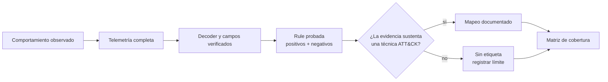

# MITRE ATT&CK y cobertura: mapear evidencia, no etiquetas

MITRE ATT&CK ofrece un lenguaje común para describir comportamientos adversarios. No convierte una alerta en un incidente, no mejora un decoder y no prueba que una técnica ocurrió. Su valor aparece cuando enlaza una detección ya comprobada con el comportamiento que realmente observa, sus límites y la telemetría que falta.

Este módulo llega después de la [primera alerta end-to-end](13-primera-alerta-end-to-end.md). Primero se demuestra que la señal existe; después se decide si el comportamiento observado justifica un mapeo ATT&CK.

## Resultado observable

Al terminar podrás distinguir táctica, técnica y sub-técnica; revisar los mapeos que Wazuh ya entrega; decidir si una rule local merece una etiqueta MITRE; y elaborar una matriz de cobertura que separe telemetría disponible, detección validada y brechas reales.

## El razonamiento correcto



La dirección importa. Empezar por una técnica y buscar después un texto que se parezca suele producir cobertura imaginaria.

| Concepto | Pregunta que responde | Ejemplo |
| --- | --- | --- |
| Táctica | ¿Qué objetivo persigue el adversario? | Acceso a credenciales. |
| Técnica | ¿Qué comportamiento usa para lograrlo? | Fuerza bruta (`T1110`). |
| Sub-técnica | ¿Qué variante concreta se observó? | Password Guessing (`T1110.001`). |
| Procedimiento | ¿Cómo se manifestó en este entorno? | Intentos SSH repetidos desde una IP. |
| Detección | ¿Qué señal y lógica permiten observarlo? | Rule, campos, umbral y prueba. |

## Lo que una alerta de autenticación sí y no demuestra

La alerta de laboratorio anterior informa de un solo `LOGIN_FAILED` para `admin`. Eso demuestra un fallo de autenticación de una aplicación; no demuestra adivinación de contraseña, uso de cuenta válida ni compromiso. Por ese motivo, la rule de M06 se dejó sin etiqueta MITRE.

| Evidencia disponible | Conclusión permitida | Conclusión que sería excesiva |
| --- | --- | --- |
| Un fallo aislado de `admin` | Hay un intento fallido que revisar. | “Se detectó fuerza bruta”. |
| Múltiples fallos del mismo origen, con ventana y umbral validados | Puede sustentar una hipótesis de password guessing. | Atribuir actor o intención confirmada. |
| Inicio de sesión correcto tras los fallos, misma identidad y origen | Señal de mayor prioridad para investigar. | Confirmar intrusión sin más contexto. |
| Logs de red, identidad y endpoint correlacionados | Línea temporal más sólida. | Cobertura total de la táctica. |

La etiqueta debe describir la conducta de la rule, no el miedo que provoca. Si la lógica detecta ocho fallos desde una IP, el mapeo candidato puede ser `T1110.001`; si detecta un fallo aislado, conservar la descripción y el grupo `authentication_failed` es más honesto.

## Revisar primero los mapeos incluidos

Wazuh entrega rules con mapeos ATT&CK. Antes de crear uno local, observa un caso ya documentado. En el manager ejecuta:

```bash
sudo /var/ossec/bin/wazuh-logtest
```

Pega esta muestra de laboratorio:

```text
Oct 15 21:07:00 linux-lab-01 sshd[29205]: Invalid user alumno from 198.51.100.44 port 48928
```

**Qué hace.** Evalúa el log con los decoders y rules instalados, incluidos sus metadatos MITRE.

**Por qué.** Permite observar un mapeo existente antes de copiar etiquetas a rules propias.

**Resultado esperado.** La fase 2 extrae usuario, IP y puerto; la fase 3 suele mostrar la rule SSH correspondiente y su información MITRE. La rule exacta depende de la versión del ruleset instalado.

**Interpretación.** La salida de `wazuh-logtest` explica qué mapeo produce tu versión. Comprueba siempre la técnica en la fuente oficial de ATT&CK antes de documentarla; una etiqueta heredada no reemplaza el análisis del comportamiento.

## Laboratorio: una ficha de mapeo antes de cambiar XML

Completa esta ficha para una detección que ya haya pasado sus pruebas. El ejemplo usa la futura correlación de ocho fallos SSH en 120 segundos; no conviertas este ejemplo en una regla activa sin calibrar el umbral de tu entorno.

| Campo | Ejemplo de decisión |
| --- | --- |
| Caso de uso | Intentos repetidos de SSH con usuario inexistente. |
| Evidencia de entrada | Log completo, IP, usuario, puerto y hora. |
| Regla y condiciones | Rule de correlación; 8 eventos / 120 s / mismo `srcip`. |
| Positivo | Ocho muestras desde `198.51.100.44` dentro de la ventana. |
| Negativo | Eventos repartidos entre orígenes o fuera de la ventana. |
| Técnica candidata | `T1110.001` — Password Guessing. |
| Justificación | La conducta observada son intentos repetidos de adivinar credenciales. |
| Limitación | NAT, proxy o pruebas autorizadas pueden generar el mismo patrón. |
| Respuesta | Investigar contexto; no bloquear automáticamente. |

Esta ficha es el contrato que debe existir antes de añadir `<mitre>` a una rule. En un entorno real se conserva junto con muestras saneadas y los resultados de pruebas, no solo en la descripción XML.

## Añadir un mapeo cuando la evidencia lo sostiene

Una vez verificada la técnica y la detección, la etiqueta se agrega dentro de la rule local:

```xml
<rule id="100102" level="10" frequency="8" timeframe="120">
  <if_matched_sid>100101</if_matched_sid>
  <same_srcip />
  <description>Academy auth: repeated failed logins from $(srcip)</description>
  <mitre>
    <id>T1110.001</id>
  </mitre>
  <group>authentication_failures,</group>
</rule>
```

El XML solo es correcto si `100101` es una rule base con nivel al menos 1 y si la prueba de secuencia demuestra la correlación. En M06 la base era una clasificación de nivel 0; ese ejemplo **no** sirve tal cual para `if_matched_sid`. Crea una base de correlación específica, con su propio contrato y pruebas, en lugar de forzar la rule introductoria.

Antes de cargar cualquier cambio, sigue el mismo gate:

```bash
sudo /var/ossec/bin/wazuh-analysisd -t
sudo /var/ossec/bin/wazuh-logtest
```

**Qué hacen.** El primero valida la configuración; el segundo comprueba decoder, rule y metadatos contra una muestra.

**Por qué.** La sintaxis válida no demuestra que el mapeo sea semánticamente correcto, y un mapeo correcto en papel no demuestra que el XML cargue.

**Resultado esperado.** Validación sin errores y pruebas con la rule/los campos esperados.

**Interpretación.** Conserva positivos, negativos y la justificación. Si falla uno, retira la etiqueta junto con la rule o vuelve a la ficha, no la mantengas como promesa de cobertura.

## Cobertura no es un porcentaje bonito

Una matriz útil separa tres estados que se confunden con facilidad:

| Estado | Significado | Evidencia exigida |
| --- | --- | --- |
| Telemetría disponible | La fuente puede producir el dato. | Muestra real, configuración y entrega. |
| Detección implementada | Existe decoder/rule para una condición. | XML validado y revisión lógica. |
| Detección validada | El comportamiento y los límites se probaron. | Positivo, negativo, resultado y contexto. |
| Brecha de telemetría | Falta la fuente o un campo necesario. | Prueba de que el dato no llega o no existe. |
| Brecha analítica | El dato llega, pero no hay lógica fiable. | Evento decodificado sin rule adecuada. |
| Fuera de alcance | No es prioridad o no puede observarse. | Decisión explícita, no una celda vacía. |

Empieza pequeño. La primera matriz puede tener solo cuatro comportamientos prioritarios:

| Comportamiento | Fuente | Estado | Próxima decisión |
| --- | --- | --- | --- |
| Fallo aislado de aplicación | `auth-service` | Validado como alerta de investigación; sin MITRE. | Definir si necesita correlación. |
| Password guessing SSH | `auth.log` / journald | Mapeo incluido por Wazuh; validar en el entorno. | Probar umbral y excepciones. |
| Cambio de archivo sensible | FIM | Aún no implementado. | Se tratará en el siguiente módulo. |
| Alta exposición vulnerable | Inventario y vulnerabilidades | Aún no implementado. | Verificar fuentes y prioridad. |

Un hueco no es un fracaso. Es una decisión pendiente con nombre, causa y siguiente prueba. El error es pintar una técnica como cubierta porque existe una rule que solo coincide parcialmente.

## Diagnóstico y retorno

| Problema | Causa habitual | Corrección |
| --- | --- | --- |
| La alerta no muestra MITRE | La rule no contiene `<mitre>` o el cambio no cargó. | Revisar XML, validar y probar en `logtest`. |
| El mapeo parece razonable pero no se puede justificar | Se empezó por la técnica, no por la evidencia. | Retirar la etiqueta y completar la ficha. |
| El conteo de correlación no funciona | Base nivel 0, regla/ventana equivocada o pruebas aisladas. | Diseñar una base nivel 1+ y probar la secuencia completa. |
| La matriz dice “cubierto” sin muestras | Se confundió presencia de rule con validación. | Cambiar estado a implementado o brecha hasta probarlo. |

Si añadiste una etiqueta o rule de laboratorio que no supera las pruebas, restaura la copia de `local_rules.xml` creada en M06, valida y reinicia el manager. El mapeo no tiene estado propio: vuelve atrás junto con la detección que describe.

## Referencias

- [MITRE ATT&CK Enterprise Matrix](https://attack.mitre.org/matrices/enterprise/)
- [MITRE ATT&CK en Wazuh](https://documentation.wazuh.com/current/user-manual/ruleset/mitre.html)
- [Sintaxis de rules de Wazuh](https://documentation.wazuh.com/current/user-manual/ruleset/ruleset-xml-syntax/rules.html)
