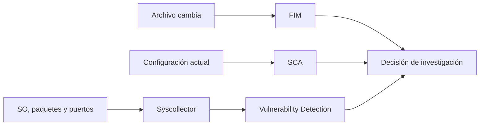

# FIM, SCA, inventario y vulnerabilidades: cuatro señales, una decisión

Estas capacidades no son cuatro formas de decir “seguridad”. FIM detecta cambios de archivos; SCA compara la configuración con una política; Syscollector describe lo instalado; Vulnerability Detection relaciona el inventario con vulnerabilidades conocidas. Cada señal responde una pregunta y tiene límites distintos.

## Resultado observable

Diseñarás un canario de FIM sin exponer secretos, interpretarás un resultado SCA sin convertirlo en incidente, contrastarás el inventario de paquetes y priorizarás una exposición con información del activo, no solo con CVSS.

## Cuatro señales, cuatro preguntas



| Capacidad | Pregunta correcta | No demuestra por sí sola |
| --- | --- | --- |
| FIM | ¿Qué ruta monitorizada cambió y cuándo? | Quién atacó o por qué cambió. |
| SCA | ¿El endpoint cumple el control de una política? | Que exista una intrusión. |
| Syscollector | ¿Qué software y componentes reporta el host? | Que el dato sea instantáneo. |
| Vulnerabilidades | ¿Un paquete inventariado coincide con una CVE? | Explotabilidad o prioridad final. |

La investigación madura combina señales: un paquete vulnerable en un servidor expuesto, con una configuración débil y un cambio reciente en una ruta relevante merece más atención que cualquiera de los hallazgos aislados.

## Diseñar el alcance

| Pregunta | Señal inicial | Canario prudente | Evidencia de cierre |
| --- | --- | --- | --- |
| ¿Cambió una configuración de aplicación? | FIM | Directorio propio de laboratorio. | Ruta, cambio y hora. |
| ¿SSH cumple la política aprobada? | SCA | Un agente Linux de laboratorio. | Política, check y resultado. |
| ¿Qué paquetes tiene el servidor? | Syscollector | Un endpoint y una hora conocida. | Inventario contrastado. |
| ¿Qué exposición requiere revisión? | Vulnerabilidades | Un activo de laboratorio. | Paquete, versión, CVE y contexto. |

No empieces monitorizando `/` ni cambiando políticas de producción para comprobar que la función existe. El primer despliegue debe ser pequeño, reversible y medible.

## Laboratorio FIM: cambio inocuo y trazable

En un agente Linux crea una ruta de práctica fuera de archivos sensibles:

```bash
sudo install -d -m 0750 /opt/wazuh-lab/fim
printf 'estado=inicial\n' | sudo tee /opt/wazuh-lab/fim/estado.conf >/dev/null
```

**Qué hace.** Crea un directorio y un archivo de laboratorio sin secretos.

**Por qué.** FIM puede informar contenido o diferencias según configuración; un canario evita la exposición de claves, tokens o datos personales.

**Resultado esperado.** Existe `/opt/wazuh-lab/fim/estado.conf`.

**Interpretación.** La ruta debe existir antes de activar modo tiempo real; si no, Wazuh puede ignorarla hasta un reinicio posterior.

En el bloque `<syscheck>` del agente o del grupo canario añade solo esta ruta:

```xml
<syscheck>
  <directories check_all="yes" realtime="yes">/opt/wazuh-lab/fim</directories>
</syscheck>
```

`realtime="yes"` monitoriza directorios locales en Linux y Windows, no archivos individuales. En Windows, las rutas UNC y unidades mapeadas no son compatibles con FIM desde Wazuh 4.13.

Reinicia exclusivamente el agente canario y crea un cambio controlado:

```bash
sudo systemctl restart wazuh-agent
sudo systemctl is-active wazuh-agent
printf 'estado=modificado\n' | sudo tee /opt/wazuh-lab/fim/estado.conf >/dev/null
```

Busca la ruta y el nombre del agente en FIM o Threat Hunting. El resultado correcto identifica archivo, tipo de cambio y hora. No afirma que el cambio sea malicioso: compáralo con ventana de mantenimiento, propietario y despliegue esperado.

### Secretos, ruido y límites

No uses `report_changes` sobre archivos con secretos. Para rutas sensibles utiliza `nodiff` y verifica qué datos saldrán del endpoint. Excluye ruido solo con evidencia: una exclusión amplia puede ocultar persistencia. Muchos árboles en tiempo real consumen watchers y CPU; mide el canario antes de ampliar el alcance.

## SCA: evaluar no es remediar

SCA verifica el estado del endpoint contra políticas YAML, muchas basadas en CIS. Las políticas distribuidas se encuentran en el ruleset del agente; no las edites ni guardes políticas propias ahí porque una actualización puede reemplazarlas. Para una primera evaluación, revisa en Configuration Assessment qué política se aplicó, el check, la evidencia y el rol del host antes de modificar nada.

| Resultado SCA | Lectura correcta | Pregunta siguiente |
| --- | --- | --- |
| Pass | El check se cumple en la última evaluación. | ¿La política aplica al rol del host? |
| Fail | El control no se cumple o no pudo verificarse. | ¿Riesgo, excepción o problema de datos? |
| Not applicable | No aplica a SO o función actual. | ¿La clasificación del activo es correcta? |

Un fallo de SCA puede requerir una decisión de hardening, una ventana y un retorno. No es una orden de cambiar SSH, permisos o servicios en caliente.

## Inventario antes de vulnerabilidades

Vulnerability Detection necesita los datos de Syscollector. Una lista vacía de CVE no demuestra que un activo esté sano si no existe inventario de paquetes reciente. Revisa primero la configuración ya presente; no reemplaces un bloque central al copiar un ejemplo:

```xml
<wodle name="syscollector">
  <disabled>no</disabled>
  <interval>1h</interval>
  <scan_on_start>yes</scan_on_start>
  <os>yes</os>
  <packages>yes</packages>
  <ports all="no">yes</ports>
  <processes>yes</processes>
</wodle>
```

En el endpoint genera evidencia local para contrastar:

```bash
cat /etc/os-release
dpkg-query -W -f='${Package}\t${Version}\n' 2>/dev/null | head -n 20
```

En sistemas RPM utiliza `rpm -qa | head -n 20`. No compares listas enormes a mano: confirma nombre, versión y hora de algunos paquetes conocidos entre endpoint y Wazuh.

En el manager, comprueba que el módulo y el procesamiento están disponibles:

```bash
sudo grep -A4 '<vulnerability-detection>' /var/ossec/etc/ossec.conf
sudo journalctl -u wazuh-manager -n 120 --no-pager | grep -iE 'vulnerab|syscollector'
```

**Qué hace.** Lee configuración y mensajes recientes de inventario/vulnerabilidades.

**Por qué.** Distingue inventario ausente, módulo desactivado y CVE no aplicable.

**Resultado esperado.** Módulo habilitado y evidencia de procesamiento acorde con tu entorno.

**Interpretación.** Si no hay paquetes inventariados, corrige primero Syscollector antes de concluir que no hay vulnerabilidades.

## Priorizar una exposición

| Dato | Pregunta que obliga a responder |
| --- | --- |
| Activo y propietario | ¿Quién valida el impacto y ejecuta el cambio? |
| Paquete y versión | ¿El inventario confirma la condición afectada? |
| Rol y exposición | ¿Está expuesto, es crítico o contiene datos sensibles? |
| CVE y fuente | ¿Qué condición técnica describe? |
| Mitigaciones | ¿Hay parche, segmentación o control compensatorio? |
| Evidencia de explotación | ¿Hay telemetría o solo exposición teórica? |
| Decisión | ¿Parchar, mitigar, aceptar temporalmente o investigar? |

Una CVE detectada no prueba explotación. Un cambio FIM tampoco prueba que ese cambio resuelva una CVE. Mantener estas distinciones impide que el dashboard se convierta en una lista de urgencias sin contexto.

## Diagnóstico y retorno

| Síntoma | Causa frecuente | Comprobación | Corrección segura |
| --- | --- | --- | --- |
| No hay eventos FIM | Ruta inexistente/no local o agente sin recargar. | Ruta, `ossec.log`, configuración efectiva. | Corregir el canario y reiniciar solo el agente. |
| Demasiados cambios FIM | Árbol amplio o datos transitorios. | Rutas y frecuencia real. | Reducir alcance; no excluir globalmente. |
| SCA falla inesperadamente | Política no aplicable o estado real. | Check, versión y rol del host. | Clasificar antes de remediar. |
| No hay CVE | Syscollector no envía paquetes o datos desactualizados. | Inventario local/central y logs. | Restablecer inventario antes de concluir. |
| CVE parece crítica | Falta exposición o mitigación. | Paquete, activo, servicio y controles. | Priorizar con propietario y evidencia. |

Para retirar el canario, elimina solo la entrada de `/opt/wazuh-lab/fim` de la configuración que modificaste, valida la configuración del agente y reinícialo. Elimina después el directorio de práctica solo si ya no necesitas conservarlo como evidencia. No cambies políticas SCA ni configuración de vulnerabilidades sin alcance y retorno aprobados.

## Referencias

- [FIM: ajustes básicos — Wazuh](https://documentation.wazuh.com/current/user-manual/capabilities/file-integrity/basic-settings.html)
- [Referencia `syscheck` — Wazuh](https://documentation.wazuh.com/current/user-manual/reference/ossec-conf/syscheck.html)
- [Security Configuration Assessment — Wazuh](https://documentation.wazuh.com/current/user-manual/capabilities/sec-config-assessment/index.html)
- [Vulnerability Detection — Wazuh](https://documentation.wazuh.com/current/user-manual/capabilities/vulnerability-detection/configuring-scans.html)
