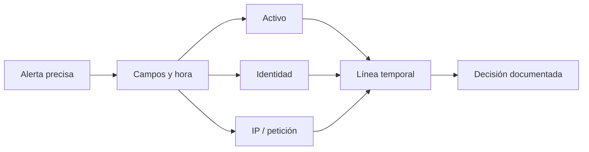

# Dashboard e investigación: de la alerta a una línea temporal

El dashboard no decide un incidente. Hace consultables alertas y eventos indexados. Investigar bien consiste en usar una alerta como punto de partida, reducir primero la incertidumbre y ampliar la consulta solo cuando aparece una relación verificable.

## Resultado observable

Podrás localizar la alerta del laboratorio por ID y marca, inspeccionar sus campos, pivotar por activo, identidad e IP, construir una línea temporal y redactar un cierre que separe hechos de hipótesis.



## La consulta empieza estrecha

En Threat Hunting selecciona una ventana corta alrededor de la alerta y busca primero el identificador más preciso:

```text
rule.id:100101 AND data.request_id:req-e2e-20260928-01
```

Adapta el ID y la marca a tu ejecución. Después inspecciona el documento antes de añadir filtros.

| Campo | Pregunta que responde | Riesgo de interpretarlo mal |
| --- | --- | --- |
| `@timestamp` | ¿Cuándo se procesó el evento? | Confundirlo con la hora original sin revisarla. |
| `agent.name` | ¿Qué endpoint reportó? | Asumir que es el origen de red. |
| `rule.id` y `rule.level` | ¿Qué lógica clasificó el evento? | Tratar el nivel como certeza de incidente. |
| `data.srcip` | ¿Qué IP extrajo el decoder? | Atribuirla a una persona sin contexto. |
| `srcuser` | ¿Qué identidad registró la fuente? | Asumir que autenticó correctamente. |
| `data.request_id` | ¿Qué correlación aporta la aplicación? | Usarlo si no fue validado en el decoder. |

## Taller: línea temporal de una alerta

1. Fija la alerta inicial con ID, agente y marca.
2. Busca el mismo agente en ±10 minutos.
3. Busca la misma IP en la misma ventana; añade `agent.name` si hay muchos resultados.
4. Busca la misma identidad, pero conserva la distinción entre fallo y éxito.
5. Ordena cronológicamente y anota solo hechos visibles.

| Consulta siguiente | Qué puede confirmar | Qué no confirma |
| --- | --- | --- |
| Mismo `agent.name` | Actividad cercana en el endpoint. | Relación causal. |
| Mismo `data.srcip` | Reutilización del origen observado. | Propietario real de la IP. |
| Mismo `srcuser` | Actividad asociada a la identidad. | Uso legítimo o compromiso. |
| Cambio FIM cercano | Cambio de archivo en la ventana. | Que el cambio causó el login fallido. |
| Inventario/CVE del activo | Contexto de exposición. | Explotación de la vulnerabilidad. |

Evita una consulta global de semanas al comienzo. Una ventana pequeña y un pivote por vez hace visibles las ausencias y reduce coincidencias accidentales.

## Comprobaciones fuera del dashboard

Si la alerta está en el manager pero no se ve en Threat Hunting, separa análisis e indexación:

```bash
sudo systemctl is-active wazuh-manager filebeat wazuh-indexer wazuh-dashboard
sudo tail -n 20 /var/ossec/logs/alerts/alerts.json
sudo journalctl -u filebeat -n 80 --no-pager
```

**Qué hace.** Comprueba servicios, evidencia local y mensajes recientes de forwarding.

**Por qué.** Una regla correcta puede quedar invisible por un retraso, error de Filebeat, indexer o filtro temporal.

**Resultado esperado.** Componentes activos, documento en alertas y ausencia de errores relevantes de envío.

**Interpretación.** `active` no garantiza indexación del documento concreto. Si está en `alerts.json`, conserva ID y marca para investigar el transporte; no recrees la alerta repetidamente.

## Hechos, hipótesis y cierre

Un cierre de investigación debe poder ser revisado por otra persona:

| Elemento | Ejemplo de contenido |
| --- | --- |
| Alcance | Agente, intervalo UTC y consultas utilizadas. |
| Hechos | Alertas, campos y cambios observados. |
| Hipótesis | Relación posible entre señales, marcada como tal. |
| Ausencias relevantes | Sin éxito posterior, sin cambio FIM, sin inventario reciente, etc. |
| Decisión | Cerrar, pedir contexto al propietario o escalar. |
| Siguiente paso | Fuente, responsable y plazo de validación. |

No guardes filtros de laboratorio como filtros globales del equipo. Retíralos al terminar para que la siguiente investigación no herede una vista parcial. Las decisiones de visualizaciones compartidas, retención e índices pertenecen a operación; se diseñan con capacidad y requisitos de evidencia, no desde una alerta aislada.

## Referencias

- [Navegación del dashboard — Wazuh](https://documentation.wazuh.com/current/user-manual/wazuh-dashboard/navigating-the-wazuh-dashboard.html)
- [Índices de alertas de Wazuh](https://documentation.wazuh.com/current/user-manual/wazuh-indexer/wazuh-indexer-indices.html)
- [Threat hunting con Wazuh](https://documentation.wazuh.com/current/getting-started/use-cases/threat-hunting.html)
