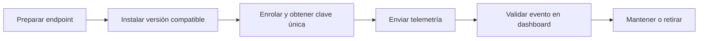
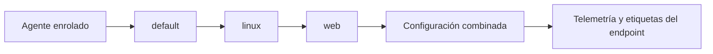

# Agentes y enrolamiento

Un agente no es un icono verde en el dashboard. Es la identidad mediante la que un endpoint entrega telemetría a la plataforma. Si esa identidad no está bien registrada, si el manager no acepta su versión o si la ruta de red falla, el resto de la cadena no importa.

## Qué ocurre al enrolar un endpoint

El enrolamiento registra el agente ante el manager y genera o utiliza una clave de cliente única. Esa clave permite cifrar la comunicación y validar la identidad del agente que intenta conectar. Por eso no es un detalle de instalación: es parte del límite de confianza de la plataforma.

La recomendación oficial es configurar la dirección IP o el FQDN del servidor para que el agente solicite e importe la clave automáticamente. También existe el enrolamiento mediante la API del servidor, útil cuando el proceso necesita integrarse en automatizaciones controladas.


## Ciclo de vida visual



| Evidencia | Qué demuestra |
| --- | --- |
| Versión del agente y manager | Compatibilidad |
| Registro de enrolamiento | Identidad autorizada |
| Evento de prueba | Telemetría útil, no solo conectividad |

## El agente como sensor, no como instalador

Después de enrolarse, el agente mantiene dos realidades que conviene no mezclar:

| Plano | Qué contiene | Dónde se decide | Riesgo si se confunde |
| --- | --- | --- | --- |
| Configuración local | Dirección del manager, identidad, servicio y opciones propias del endpoint. | Equipo que administra el host. | Sobrescribir una necesidad local con una directiva genérica. |
| Configuración centralizada | Fuentes de logs, FIM, SCA, inventario, etiquetas y otras directivas compartidas. | Manager, mediante grupos. | Aplicar una configuración de servidor a una estación de trabajo. |
| Datos del endpoint | Logs, inventario, cambios de archivos y resultados de módulos. | El host y sus fuentes. | Creer que una política crea datos que el host no produce. |

Esta separación permite escalar sin clonar archivos de configuración por cada máquina. También explica por qué un agente conectado puede comportarse distinto de otro: ambos pueden tener la misma versión, pero pertenecer a grupos con directivas diferentes.

## Grupos: traducir el inventario a configuración

Un grupo debe representar una necesidad de telemetría o una responsabilidad clara, no una lista accidental de equipos. Wazuh asigna inicialmente los agentes al grupo `default`; después pueden pertenecer a uno o varios grupos. El manager conserva las configuraciones compartidas en rutas como `/var/ossec/etc/shared/<grupo>/agent.conf` y las distribuye a los miembros.

| Buen criterio de grupo | Ejemplo | Configuración que podría compartir |
| --- | --- | --- |
| Sistema operativo | `linux`, `windows`. | Fuentes y políticas propias de cada plataforma. |
| Rol técnico | `web`, `database`, `domain-controller`. | Logs de aplicación, rutas FIM o inventario relevante. |
| Criticidad o entorno | `laboratorio`, `produccion`, `dmz`. | Etiquetas, intervalos y cobertura adaptada al riesgo. |
| Propietario | `equipo-pagos`, `infraestructura`. | Contexto para triage, no secretos ni permisos administrativos. |

Evita nombres como `grupo-nuevo` o mezclar propósito y ubicación sin necesidad. Si un agente recibe varios grupos, una configuración puede tener precedencia sobre otra. Por eso la asignación debe ser deliberada y se debe comprobar el resultado en un agente canario antes de aplicarla a una familia completa.



## Aplicar una configuración centralizada sin perder el control

La configuración centralizada no requiere reiniciar todos los agentes a mano. El manager distribuye los archivos compartidos y los agentes comprueban si han cambiado. Eso reduce trabajo, pero amplifica un error de sintaxis o de alcance.

Procedimiento prudente para una nueva directiva:

1. Crea el grupo y asigna un único agente canario.
2. Escribe la configuración en un archivo temporal del grupo, no directamente sobre el activo.
3. Valida la sintaxis con `verify-agent-conf` en el manager.
4. Publica el archivo validado como `agent.conf` del grupo.
5. Comprueba en el canario el estado, el log del agente y la evidencia que la directiva debía producir.
6. Solo entonces amplía la pertenencia al grupo.

Ejemplo de validación en el manager, antes de activar una configuración temporal:

```bash
sudo /var/ossec/bin/verify-agent-conf \
  -f /var/ossec/etc/shared/lab-linux/agent.conf.tmp
```

El comando comprueba que el XML entregado a los agentes sea válido. No garantiza que la ruta de un log exista en cada host ni que la regla asociada sea correcta; esas pruebas se realizan con el agente canario y su evidencia.

## Cinco capas de salud de un agente

El diagnóstico rápido anterior gana precisión si se recorre siempre en el mismo orden:

| Capa | Pregunta | Evidencia útil | Qué hacer si falla |
| --- | --- | --- | --- |
| 1. Red | ¿El endpoint alcanza 1514 y, si aplica, 1515? | `nc` o `Test-NetConnection`. | Revisar DNS, ruta y firewall. |
| 2. Servicio | ¿El proceso y sus componentes están en marcha? | `systemctl`, `wazuh-control` o `Get-Service`. | Leer el log local antes de reiniciar. |
| 3. Identidad | ¿El manager reconoce al endpoint con nombre y grupo correctos? | Estado en dashboard o `agent_control`. | Comparar nombre, versión y enrolamiento; nunca copiar claves. |
| 4. Configuración | ¿El agente recibió la política que esperabas? | Hash y estado de grupo en el manager; log local. | Validar alcance y sintaxis de la configuración central. |
| 5. Datos | ¿La fuente genera y entrega una señal comprobable? | Log de origen, evento o alerta consultable. | Ir a la lección de recolección, no a rules. |

El orden evita diagnósticos circulares. Una alerta ausente no se arregla modificando detecciones mientras el endpoint ni siquiera puede abrir una conexión al manager.

## Compatibilidad antes que velocidad

El manager debe tener la misma versión o una versión posterior a la de los agentes conectados. Esta regla es sencilla y evita una clase entera de problemas difíciles de diagnosticar. Los ejemplos de agentes fijados a 4.14.7 deben revisarse antes de usarse con despliegues por paquetes 4.14.8.

No conviertas el enrolamiento en una carrera por instalar muchos endpoints. Empieza con uno: confirma que se registra, que mantiene comunicación, que envía un evento esperado y que ese evento puede seguirse hasta el dashboard. Luego automatiza.

## Ciclo de vida útil

1. Preparas el endpoint y defines su grupo o propósito.
2. Instalas el agente con la versión compatible.
3. Lo enrolas y verificas su identidad.
4. Confirmas que entrega telemetría y recibe la configuración prevista.
5. Mantienes inventario, actualizaciones y retirada ordenada.

El paso cinco suele olvidarse. Un agente abandonado, una clave que no se revoca o un endpoint sin propietario son deuda operativa, aunque figure como conectado.

### Incorporar, mantener y retirar

| Momento | Decisión que debe quedar clara | Evidencia mínima |
| --- | --- | --- |
| Alta | Nombre único, grupo existente, propietario y método de enrolamiento. | Agente activo y primera señal identificable. |
| Cambio de función | Si el grupo y las fuentes siguen representando el rol del host. | Configuración recibida y prueba de la nueva fuente. |
| Actualización | Manager igual o posterior al agente y canal de paquete compatible. | Versiones anotadas y salud posterior. |
| Baja | Si el endpoint ya no enviará datos y qué retención necesita su historial. | Servicio retirado, registro central eliminado solo tras confirmación. |

La baja no es “borrar un icono rojo”. Primero confirma que el host se ha retirado o ya no debe monitorizarse, conserva la evidencia requerida y elimina la identidad central mediante un procedimiento autorizado. La documentación oficial permite hacerlo desde dashboard, CLI o API; en este curso se usará el método menos automatizado que permita revisar el objetivo antes de confirmar.

## Ejemplo de diagnóstico

Imagina un endpoint de laboratorio 198.51.100.20 que aparece como desconectado. No empieces modificando rules. Primero pregunta: ¿el servicio del agente está activo?, ¿resuelve el FQDN del manager?, ¿la red permite la conexión?, ¿la clave y la versión son compatibles? Solo cuando esas respuestas estén documentadas tiene sentido revisar la configuración de recolección.

## Validación mínima

Para cada nuevo grupo de agentes conserva evidencia de:

- versión del manager y de los agentes;
- método de enrolamiento usado;
- identidad o nombre del endpoint;
- conectividad confirmada;
- una señal de prueba que llegue al dashboard.

Esa pequeña disciplina convierte un despliegue en algo que se puede auditar y reparar.

## Práctica: diagnóstico de un agente en cinco minutos

> Escenario de laboratorio. Los comandos comprueban estado y conectividad; no muestran ni modifican claves de enrolamiento.

En Linux, sustituye `<manager-fqdn>` por el nombre que uses en tu laboratorio:

```bash
sudo systemctl status wazuh-agent --no-pager
nc -zvw3 <manager-fqdn> 1514
sudo tail -n 50 /var/ossec/logs/ossec.log
```

En Windows, la misma comprobación de red puede hacerse con:

```powershell
Test-NetConnection -ComputerName <manager-fqdn> -Port 1514
```

No busques una única frase mágica en el log. Relaciona cada resultado con una hipótesis:

| Evidencia | Hipótesis que gana fuerza | Qué no demuestra |
| --- | --- | --- |
| El servicio está detenido | El agente no puede enviar telemetría. | Que la red o el enrolamiento estén bien. |
| El puerto no es alcanzable | DNS, ruta o firewall pueden impedir la comunicación. | Que la identidad del agente sea válida. |
| Hay conexión, pero no hay eventos | La ingesta configurada puede no cubrir la fuente. | Que el dashboard esté fallando. |
| Hay eventos sin alerta | El recorrido de datos funciona hasta el análisis. | Que exista una rule para ese caso. |

El orden importa: servicio, red, identidad y datos. Cambiar una rule antes de confirmar los tres primeros pasos añade ruido al diagnóstico.

## Errores habituales

- Compartir o reutilizar identidades de agentes.
- Subir agentes por delante del manager.
- Considerar un agente conectado como prueba de que recoge todos los logs relevantes.
- Publicar claves, contraseñas o FQDN internos en documentación de aprendizaje.
- Asignar un grupo que no existe y asumir que el agente recibió la configuración prevista.
- Probar una política nueva directamente sobre todos los endpoints del mismo rol.
- Eliminar un agente desconectado sin confirmar si el host sigue siendo un activo que necesita investigación.

## Límite y siguiente paso

Un agente conectado es el comienzo, no la meta. La siguiente lección recorre qué datos recoge Wazuh, qué ocurre con ellos y cómo distinguir un problema de ingesta de un problema de detección.

## Referencias

- [Enrolamiento de agentes](https://documentation.wazuh.com/current/user-manual/agent/agent-enrollment/index.html)
- [Métodos de enrolamiento](https://documentation.wazuh.com/current/user-manual/agent/agent-enrollment/enrollment-methods/index.html)
- [Grupos de agentes](https://documentation.wazuh.com/current/user-manual/agent/agent-management/grouping-agents.html)
- [Configuración centralizada](https://documentation.wazuh.com/current/user-manual/reference/centralized-configuration.html)
