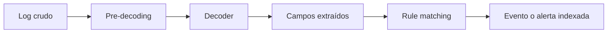
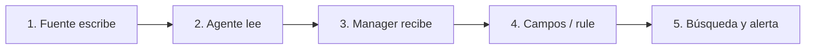

# Recolección y procesamiento de logs

La detección empieza antes de una rule. Empieza cuando una fuente produce un registro, alguien decide que merece ser recogido y la plataforma conserva suficiente contexto para interpretarlo. Si una de esas piezas falta, el dashboard puede estar impecable y aun así no contar la historia que necesitas.

## De dónde llegan los datos

Wazuh puede recolectar registros de endpoints mediante agentes, de aplicaciones, de dispositivos de red, por Syslog y mediante integraciones compatibles. Esto permite combinar visibilidad de host y de red, pero no implica que todas las fuentes queden cubiertas por defecto. Cada fuente requiere una decisión explícita: qué se recoge, para qué, durante cuánto tiempo y quién responde cuando deja de llegar.

En un agente, la configuración local puede indicar archivos concretos que vigilar. La configuración centralizada permite distribuir ajustes a varios endpoints de un grupo. La segunda opción reduce trabajo repetido, pero exige más cuidado: un error de alcance puede afectar a muchos sistemas a la vez.

## Un mapa de fuentes que sí responde preguntas

No conviene recolectar “todos los logs” por inercia. Una fuente vale cuando completa una investigación que hoy quedaría a medias. Este mapa, derivado de escenarios de operación, ayuda a escoger por dónde empezar:

| Fuente | Pregunta que ayuda a responder | Contexto que no debe faltar |
| --- | --- | --- |
| Linux: autenticación y `sudo` | ¿Quién intentó o obtuvo acceso privilegiado? | Usuario, origen, host y hora. |
| Windows: eventos de seguridad | ¿Hubo inicio de sesión, cambio de grupo o ejecución relevante? | Cuenta, equipo, identificador de evento y hora. |
| NGINX o aplicación web | ¿Qué petición produjo un error, un `401` o un `500`? | Ruta, código HTTP, cliente y correlación de aplicación. |
| Firewall o router | ¿La red permitió, bloqueó o encaminó la comunicación? | Origen, destino, puerto, acción y dispositivo emisor. |
| Servicio de identidad | ¿Una autenticación fallida coincide con actividad del endpoint? | Identidad, aplicación, IP origen y hora sincronizada. |

La última columna es decisiva. Un mensaje que solo dice “login failed” puede llamar la atención, pero no permite saber a qué cuenta afectó, desde dónde vino ni con qué otra actividad relacionarlo. Antes de crear una rule, examina una muestra real de la fuente y decide qué campos necesitas conservar.

## Elegir formato y fuente sin perder contexto

`localfile` es la pieza de configuración que indica al agente qué debe leer. La ruta por sí sola no basta: el formato debe describir el origen para que el logcollector lo entregue correctamente al análisis.

| Entorno | Fuente inicial razonable | `location` | `log_format` | Qué validar primero |
| --- | --- | --- | --- | --- |
| Debian/Ubuntu | Autenticación | `/var/log/auth.log` | `syslog` | Que el archivo existe y recibe líneas nuevas. |
| RHEL/Alma/Rocky | Autenticación | `/var/log/secure` | `syslog` | Que SSH y `sudo` escriben en esa ruta. |
| systemd | Journal | `journald` | `journald` | Que el servicio y los campos filtrados existen. |
| Windows | Security, System o Application | Nombre del canal | `eventchannel` | Que el canal está habilitado en Event Viewer. |
| Aplicación JSON | Archivo local NDJSON/JSON por línea | Ruta local | `json` | Que cada línea es un objeto JSON válido. |
| Servicio web | Access/error log local | Ruta del log | Formato que corresponda | Que incluye cliente, ruta, método y código. |

No uses el mismo bloque para rutas que tienen formatos diferentes. Un archivo de aplicación JSON, por ejemplo, no se vuelve Syslog porque se llame `.log`. La decisión de formato determina qué puede extraerse después.

### Linux: archivos planos y journald

Un origen tradicional de Linux se declara de esta forma:

```xml
<localfile>
  <location>/var/log/auth.log</location>
  <log_format>syslog</log_format>
</localfile>
```

En sistemas con `journald`, Wazuh puede leer el journal directamente. El bloque general ya suele existir en instalaciones actuales; un filtro permite reducir ruido a una unidad concreta:

```xml
<localfile>
  <location>journald</location>
  <log_format>journald</log_format>
  <filter field="_SYSTEMD_UNIT">^ssh.service$</filter>
</localfile>
```

Antes de aplicar un filtro, observa la unidad real en el endpoint. Según distribución y servicio, puede ser `ssh.service`, `sshd.service` u otro nombre. Compruébalo con una lectura local:

```bash
journalctl -u ssh.service -n 20 --no-pager
```

El resultado esperado no es una alerta: es una muestra que demuestre que eliges la unidad y los campos correctos. Si la unidad no existe, cambiar Wazuh no arreglará el problema; hay que identificar el servicio real.

### Windows: canales, no archivos de texto

Los canales `Security`, `System` y `Application` son puntos de partida. Para recolectar un canal de Windows usa `eventchannel`:

```xml
<localfile>
  <location>Security</location>
  <log_format>eventchannel</log_format>
</localfile>
```

Para una fuente más específica, como Sysmon, cambia el nombre del canal, no el formato:

```xml
<localfile>
  <location>Microsoft-Windows-Sysmon/Operational</location>
  <log_format>eventchannel</log_format>
</localfile>
```

Una query XPath puede bajar volumen cuando ya sabes qué necesitas. Empieza sin filtro en un canario, examina la muestra y filtra después. Por ejemplo, una consulta de laboratorio para un identificador concreto:

```xml
<localfile>
  <location>System</location>
  <log_format>eventchannel</log_format>
  <query>Event/System[EventID=7040]</query>
</localfile>
```

Comprueba la fuente antes de configurar el agente:

```powershell
Get-WinEvent -ListLog Security | Select-Object LogName, RecordCount, IsEnabled
Get-WinEvent -ListLog Microsoft-Windows-Sysmon/Operational
```

Desde Wazuh 4.13, una ruta UNC o unidad de red mapeada en Windows no es una fuente válida para el agente. Si una aplicación deja logs en un recurso compartido, diseña una recolección local o un relay; no esperes que `\\servidor\recurso\archivo.log` funcione silenciosamente.

### Aplicaciones y JSON

Las aplicaciones suelen aportar el contexto que falta a los logs del sistema: usuario de negocio, endpoint HTTP, identificador de petición, resultado y dependencia afectada. Una aplicación que escribe JSON por línea puede declararse así:

```xml
<localfile>
  <location>/var/log/myapp/events.json</location>
  <log_format>json</log_format>
  <label key="@source">myapp</label>
  <label key="agent.role">webserver</label>
</localfile>
```

Las etiquetas añaden contexto estable sin modificar la aplicación. No reemplazan campos que ya existan en el evento. Antes de recolectar un log de aplicación, pide una muestra y revisa cuatro cosas: si cada línea es independiente, cómo rota el archivo, qué información sensible contiene y qué identificador permite relacionarlo con otras fuentes.

### Syslog de dispositivos sin agente

Firewall, router y switch pueden enviar Syslog al manager o a un relay. El dato útil no es “hubo tráfico”, sino una acción con origen, destino, puerto, protocolo, dispositivo y hora. Para el primer laboratorio, usa un solo dispositivo o un emisor sintético y conserva una muestra del mensaje original. La configuración de listener, TLS, buffering y segmentación de red se desarrolla en el módulo de integraciones; aquí la condición de entrada es tener un mensaje que se pueda interpretar.

## El tiempo es un campo de seguridad

La investigación entre hosts depende de relojes comparables. Si el servidor web registra a las 10:15 y el controlador de identidad tiene cinco minutos de retraso, una línea temporal puede invertir causa y efecto.

| Sistema | Comprobación de lectura | Qué mirar |
| --- | --- | --- |
| Linux con systemd | `timedatectl status` | Sincronización, zona y hora del sistema. |
| Linux con chrony | `chronyc tracking` | Fuente de referencia y desfase. |
| Windows | `w32tm /query /status` | Origen y estado de sincronización. |

Una hora correcta en el dashboard no demuestra que los endpoints la tengan. Valida al menos manager, agente y una fuente de red antes de correlacionar un caso complejo.


## Del registro a la alerta



| Pregunta | Ejemplo de evidencia |
| --- | --- |
| ¿La fuente generó el log? | Registro local o del dispositivo |
| ¿Wazuh lo recibió? | Evidencia de ingesta |
| ¿Se interpretó bien? | Fields extraídos por decoder |
| ¿La regla actuó? | Alerta o justificación de no coincidencia |

## Qué hace el motor con un log

Una vez recibido, el motor realiza tres pasos que conviene distinguir:

1. **Pre-decoding**: identifica datos de cabecera, como fecha, host o programa cuando el formato lo permite.
2. **Decoding**: busca el formato del registro y extrae campos útiles, por ejemplo una dirección IP, un usuario o un identificador de evento.
3. **Rule matching**: compara el evento decodificado con reglas de detección. Una coincidencia genera una alerta.

Los registros que no generan alerta siguen teniendo valor. Pueden servir para investigación, auditoría o para explicar por qué una detección no funcionó. Confundir evento y alerta es una de las formas más rápidas de llegar a conclusiones equivocadas.

## Un ejemplo útil

Un servicio en 203.0.113.15 escribe un evento de autenticación. El agente o la fuente Syslog lo entrega al servidor. Si el formato se reconoce, el decoder extrae campos. Una rule puede considerar relevante una combinación de esos campos y producir una alerta. Si no aparece en el dashboard, recorre la cadena en orden: fuente, recolección, decoding, rule, indexación y consulta.

Ese orden ahorra tiempo. Cambiar una rule no arregla una fuente que nunca envió datos. Ajustar el dashboard no arregla un decoder que no reconoció el formato.

## Validar una fuente de manera seria

Antes de declarar una fuente cubierta, prueba estas preguntas:

- ¿El sistema produjo el registro esperado?
- ¿El agente o la integración lo recogió?
- ¿El servidor recibió el dato?
- ¿Se extrajeron los campos relevantes?
- ¿La rule correcta produjo, o no debía producir, una alerta?
- ¿El analista puede encontrar el resultado sin conocer de antemano el identificador exacto?

Guarda la evidencia de esa prueba. Una captura aislada demuestra poco; una cadena de evidencias demuestra el recorrido.

## Protocolo de trazabilidad para una fuente nueva

Usa un marcador único y recorre siempre los mismos puntos. El objetivo es separar una falla de generación, recolección, transporte, análisis o búsqueda.



1. Genera o localiza una línea con un identificador único, por ejemplo `TRACE_WAZUH_M04_01`.
2. Confirma que aparece en el archivo, canal o dispositivo de origen.
3. Comprueba el servicio y el log del agente sin revelar claves.
4. Si los archivos de archivo del manager están habilitados para el laboratorio, busca allí el identificador para distinguir recepción de alerta. Los archives pueden crecer rápido; habilítalos temporalmente y con espacio controlado.
5. Busca por identificador, agente y ventana de tiempo corta en el dashboard.
6. Anota si el resultado fue evento, alerta o ausencia justificada. La ausencia también es una conclusión útil si sabes en qué punto ocurrió.

Los módulos de decoders y rules usarán la misma muestra para comprobar campos y detección. Reutilizar una evidencia conocida evita crear reglas sobre texto imaginado.

## Práctica: incorporar una fuente local de forma reversible

> Escenario de laboratorio para un agente Linux. Adapta ruta y formato a tu sistema; no copies esta configuración a producción sin revisar la guía de la versión instalada.

Primero conserva una copia fechada de la configuración del agente. Después añade una sola fuente local y genera un evento que puedas reconocer:

```xml
<localfile>
  <location>/var/log/auth.log</location>
  <log_format>syslog</log_format>
</localfile>
```

```bash
sudo cp -a /var/ossec/etc/ossec.conf /var/ossec/etc/ossec.conf.before-log-lab
logger -t curso-wazuh "prueba de recoleccion desde 192.0.2.25"
```

La copia permite volver al punto anterior si la ruta o el formato eran incorrectos. El `logger` solo crea una marca en el registro local; no garantiza una alerta. Tras aplicar la configuración siguiendo el procedimiento de tu versión, busca `curso-wazuh` en este orden:

1. En el archivo local configurado.
2. En la telemetría recibida por Wazuh.
3. En los campos extraídos por el decoder.
4. En alertas, solo si una rule aplicable coincide.

Este pequeño ejercicio enseña una diferencia importante: recolectar un log, extraer campos y alertar son tres resultados distintos. Si el experimento no sale como esperas, restaura la copia antes de probar otra hipótesis.

## Fallos frecuentes

Un path incorrecto, un formato de log mal declarado, una ruta de red no soportada o un grupo de configuración equivocado pueden dejar una fuente silenciosamente sin cobertura. En Windows, la documentación actual advierte que desde 4.13 la recolección no admite rutas UNC ni unidades de red mapeadas: deben ser archivos locales.

## Límite y siguiente paso

Esta lección explica el camino de los datos, no diseña reglas personalizadas. Cuando entiendas el recorrido, la siguiente fase natural es estudiar decoders, rules y pruebas de detección con una muestra controlada.

## Referencias

- [Recolección de logs](https://documentation.wazuh.com/current/user-manual/capabilities/log-data-collection/index.html)
- [Cómo funciona](https://documentation.wazuh.com/current/user-manual/capabilities/log-data-collection/how-it-works.html)
- [Análisis de logs](https://documentation.wazuh.com/current/user-manual/capabilities/log-data-collection/log-data-analysis.html)
