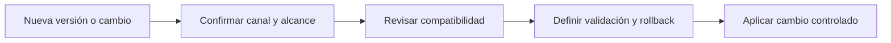

# Vigencia y compatibilidad de versiones

Las versiones parecen un detalle hasta que un curso se convierte en una instalación. Entonces una guía escrita para un parche, un contenedor que sigue otro canal y un manager actualizado por separado pueden producir una plataforma que nadie sabe explicar ni recuperar.

## Dos verdades que deben convivir

El curso conserva 4.14.7 como baseline pedagógico reproducible. La documentación y los paquetes oficiales se verificaron en 4.14.8 el 2026-09-26. Ambas afirmaciones son compatibles porque describen cosas distintas: una fija el contexto de aprendizaje y la otra informa del estado observado del fabricante.

El error sería transformar una de ellas en una orden automática. Un baseline formativo no es una recomendación de producción. Una release nueva tampoco es una invitación a actualizar sin revisar compatibilidad, canal y plan de vuelta atrás.

## Matriz de decisión

| Situación | Decisión correcta |
| --- | --- |
| El curso usa 4.14.7 y paquetes muestran 4.14.8 | Revisar diferencias antes de adaptar una guía |
| Docker estable no coincide con paquetes | Tratar cada canal por separado |
| Manager menor que un agente | Detener el cambio y corregir compatibilidad |
| No hay plan de retorno | No iniciar la actualización |

## Leer una versión con contexto

Antes de seguir una guía, anota cuatro datos:

- el canal de instalación: paquetes o Docker;
- la versión exacta del servidor, indexer y dashboard;
- la versión de los agentes;
- la fuente que confirma el estado de ese canal.

Los componentes centrales deben compartir la misma versión, incluido el parche. El manager debe tener una versión igual o posterior a la de los agentes conectados. Estas dos reglas son más útiles que memorizar una cifra aislada.

## Una decisión de actualización bien hecha

No actualices porque apareció un número nuevo. Actualiza porque existe una razón documentada: corrección de seguridad, requisito de soporte, incompatibilidad conocida o mejora que el entorno necesita. Después define qué se comprobará: salud de componentes, comunicación de agentes, llegada de eventos, indexación, dashboard y detecciones críticas.

El rollback también se decide antes. Si no puedes explicar qué versión se restaurará, cómo se validará y qué datos podrían verse afectados, todavía no tienes una ventana de cambio; tienes una apuesta.

## Ejemplo

Un laboratorio usa Docker 4.14.7 y una guía de paquetes menciona 4.14.8. La respuesta correcta no es mezclar instrucciones. Primero se confirma el canal de Docker y su release estable. Si se elige migrar de canal o de versión, se abre una revisión específica con evidencia y un plan de retorno.

## Práctica: decidir una actualización pequeña

> Patrón de trabajo derivado de operación de laboratorio. No reemplaza las notas de release ni el procedimiento oficial de actualización de tu canal.

Imagina que el laboratorio funciona y aparece un parche nuevo. Antes de tocar un componente, crea una hoja de decisión corta:

| Pregunta | Evidencia que pedir | Decisión si falta |
| --- | --- | --- |
| ¿Qué corrige esta versión? | Nota de release del canal exacto. | No programar la actualización. |
| ¿Qué componentes deben coincidir? | Inventario de manager, indexer, dashboard y agentes. | Detenerse si hay parches mezclados. |
| ¿Cómo se medirá el éxito? | Lista de salud, un agente conectado, un evento y una consulta. | No iniciar sin criterios observables. |
| ¿Cómo se vuelve atrás? | Versión objetivo de retorno y copia recuperable. | Convertir el cambio en laboratorio, no en producción. |

Después prueba primero con un conjunto pequeño y no crítico de endpoints. Compara antes y después: conectividad de agentes, llegada de una señal conocida, búsqueda en el dashboard y una detección importante para tu entorno. Si una de esas pruebas falla, detenerse es un resultado correcto: evita que una actualización se convierta en una investigación improvisada.

## Señales para detenerse

Detén una actualización si una guía no declara versión, si un componente central queda en otro parche, si un agente supera al manager o si no hay evidencia de respaldo y recuperación. Son condiciones para revisar, no obstáculos burocráticos.

## Límite del curso

Esta lección no sustituye las notas de release ni el procedimiento de actualización aplicable a una instalación real. Su objetivo es enseñar a no confundir documentación histórica, baseline pedagógico y configuración operativa.

## Referencias

- [Documentación oficial de Wazuh](https://documentation.wazuh.com/current/)
- [Arquitectura de Wazuh](https://documentation.wazuh.com/current/getting-started/architecture.html)
