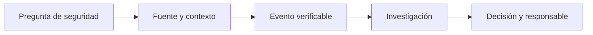

# Casos de uso: de la señal a la decisión

Un caso de uso no es una lista de módulos activados. Es una pregunta de seguridad con una fuente, una evidencia esperada y una decisión posterior. Si falta una de las cuatro, probablemente solo tendrás más datos, no más visibilidad.

## Cómo leer los casos

Los escenarios siguientes mezclan capacidades documentadas de Wazuh con patrones de trabajo de laboratorio. Los nombres de logs, campos y reglas pueden variar según sistema operativo, versión y configuración. Úsalos para formular hipótesis y validar tu entorno, no como promesa de una alerta idéntica.

## Caso 1: accesos fallidos que dejan de ser ruido

**Pregunta:** ¿un mismo origen está intentando acceder a varias cuentas o servicios?

Una línea de SSH fallida por sí sola suele ser ruido. Gana valor cuando conserva usuario, IP de origen, host y hora, y cuando se puede contrastar con los accesos posteriores de esa misma identidad o dirección.

| Capa | Evidencia que buscar | Decisión que permite |
| --- | --- | --- |
| Host Linux | Eventos de autenticación y `sudo`. | Confirmar si hubo acceso posterior o elevación. |
| Aplicación web | Errores `401` o `403` del mismo origen. | Saber si el intento alcanzó otro servicio. |
| Firewall | Acción sobre el flujo y destino. | Distinguir actividad bloqueada de actividad permitida. |
| Wazuh | Evento decodificado y, si corresponde, alerta. | Abrir investigación con un punto de partida verificable. |

**Ejemplo de lectura:** cinco fallos de SSH desde `198.51.100.42` no prueban intrusión. Si dos minutos después existe un acceso correcto de una cuenta administrativa desde ese origen, el analista ya tiene una línea temporal para verificar con el propietario de la cuenta. La decisión no es bloquear por reflejo: primero confirma alcance, legitimidad y recurrencia.

## Caso 2: un archivo sensible cambió

**Pregunta:** ¿qué cambió en una ruta crítica y merece una revisión humana?

FIM resulta útil para configuraciones de aplicación, scripts de despliegue o directorios donde un cambio no debería pasar desapercibido. No sirve para vigilar de forma indiscriminada árboles que cambian constantemente: eso genera volumen y acostumbra al equipo a ignorar alertas.

| Evidencia FIM | Interpretación inicial | Comprobación siguiente |
| --- | --- | --- |
| Cambio de contenido o hash | El archivo no coincide con la línea base. | Comparar el diff o la versión aprobada. |
| Cambio de propietario o permisos | Puede alterar quién puede leer o ejecutar. | Revisar proceso, cuenta y ticket asociado. |
| Archivo nuevo en una ruta vigilada | Puede ser despliegue, residuo o persistencia. | Identificar origen, fecha y función. |

**Ejemplo de lectura:** cambia un archivo bajo la configuración de una aplicación justo después de una ventana de despliegue. FIM entrega una señal; no decide que sea un incidente. El responsable de la aplicación contrasta el cambio con la versión liberada. Si no hay despliegue ni explicación, la misma evidencia sirve para preservar la línea temporal, restringir el alcance y escalar la investigación.

## Caso 3: vulnerabilidad no equivale a compromiso

**Pregunta:** ¿qué equipo necesita atención prioritaria tras aparecer una CVE relevante?

La detección de vulnerabilidades relaciona inventario de software y contenido de vulnerabilidades. Por eso su resultado es una hipótesis de exposición que debe confirmarse, no una prueba de explotación.

1. Comprueba que el agente entregó inventario reciente de paquetes u hotfixes.
2. Identifica la versión instalada, el activo y su propietario.
3. Consulta si el servicio vulnerable está realmente desplegado y expuesto en ese activo.
4. Prioriza con contexto: criticidad del sistema, exposición, compensaciones y disponibilidad de parche.
5. Tras corregir, espera o fuerza el ciclo de inventario aplicable y verifica que la observación ya no aparece.

**Ejemplo de lectura:** dos servidores muestran la misma CVE. Uno es un laboratorio aislado; el otro publica una aplicación de negocio y tiene el servicio afectado en ejecución. La severidad técnica puede ser idéntica, pero la prioridad operativa no. Wazuh aporta inventario y visibilidad; la decisión exige conocer el activo.

## Caso 4: el incidente está entre dos fuentes

**Pregunta:** ¿qué ocurrió antes y después de un fallo de autenticación en una aplicación?

El valor de un SIEM aparece cuando las fuentes conservan una hora comparable. Si el endpoint, el firewall y el proveedor de identidad tienen relojes diferentes, una línea temporal puede invertir causa y efecto.

| Momento | Fuente | Pregunta de investigación |
| --- | --- | --- |
| 10:15:03 UTC | Identidad | ¿Falló o se aprobó el inicio de sesión? |
| 10:15:05 UTC | Aplicación | ¿Qué recurso pidió la identidad? |
| 10:15:06 UTC | Firewall | ¿Se permitió la conexión al servicio? |
| 10:15:09 UTC | Endpoint | ¿Apareció un proceso, error o cambio relacionado? |

No asumas que las cuatro señales prueban una cadena causal: construye la hipótesis y busca el identificador de usuario, IP, host o correlación de aplicación que la sostenga. Este hábito evita que una coincidencia temporal se convierta en una conclusión apresurada.

## Elegir el primer caso de uso

Empieza donde puedas completar el ciclo entero con pocas personas: una fuente conocida, un activo con propietario, un evento de prueba y alguien que pueda decidir qué hacer con el resultado. Un buen primer caso deja además un patrón reutilizable para el siguiente.

| Si el equipo necesita… | Empieza por… | Evita inicialmente… |
| --- | --- | --- |
| Proteger un servidor crítico | FIM en pocas rutas de configuración y autenticación del host. | Monitorizar todo el sistema de archivos. |
| Investigar accesos | Autenticación Linux o Windows y una aplicación relevante. | Correlaciones complejas sin campos consistentes. |
| Reducir exposición | Inventario y vulnerabilidades de un grupo pequeño. | Tratar todas las CVE como incidentes. |
| Dar visibilidad a red | Syslog de un firewall con acción, origen y destino. | Enviar mensajes sin propietario ni retención definida. |

## Referencias

- [Casos de uso de Wazuh](https://documentation.wazuh.com/current/getting-started/use-cases/index.html)
- [File Integrity Monitoring](https://documentation.wazuh.com/current/user-manual/capabilities/file-integrity/index.html)
- [Vulnerability Detection](https://documentation.wazuh.com/current/user-manual/capabilities/vulnerability-detection/index.html)
- [Recolección de logs](https://documentation.wazuh.com/current/user-manual/capabilities/log-data-collection/index.html)
