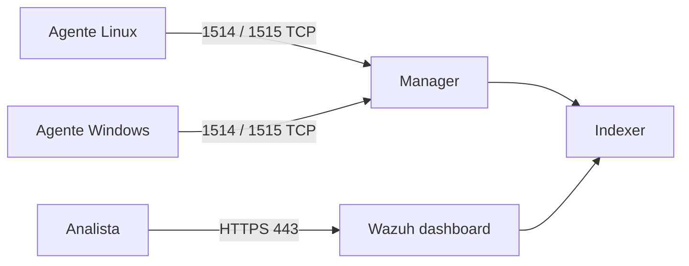

# Laboratorio: desplegar Wazuh All-in-One

Este laboratorio instala manager, indexer y dashboard en una sola máquina Linux. Es la topología adecuada para aprender, validar agentes y comprender el recorrido de los datos. No equivale a un diseño de alta disponibilidad ni a una recomendación de capacidad para producción.

## Antes de empezar

Reserva un host limpio y una dirección estable. Para que los agentes puedan volver a conectar después de reinicios, usa un FQDN o una IP reservada. Consulta los requisitos de hardware de la versión antes de instalar: el consumo real depende de eventos, retención e indexación.

| Elemento | Laboratorio | Por qué importa |
| --- | --- | --- |
| Host | Linux de 64 bits compatible con el asistente oficial. | Ejecutará los tres componentes centrales. |
| Nombre | `wazuh-lab.example.test` en este ejemplo. | Es el valor que usarán los agentes. |
| Red | Acceso desde el analista a HTTPS y desde agentes a 1514/1515 TCP. | Separa consola, enrolamiento y telemetría. |
| Punto de retorno | Snapshot de la VM antes de instalar. | Permite repetir el laboratorio sin borrar a ciegas. |



## 1. Preparar el host

En Ubuntu o Debian, actualiza el índice de paquetes e instala las utilidades que necesita el asistente. Sustituye el hostname por el que hayas reservado.

```bash
sudo hostnamectl set-hostname wazuh-lab
sudo apt-get update
sudo apt-get install -y curl tar
free -h
df -h /
ip -brief addr
```

**Qué comprobar:** memoria y espacio disponibles, la IP que usarán los agentes y que no haya otro servicio ocupando HTTPS. `free -h` y `df -h /` no aprueban por sí solos el diseño: solo evitan iniciar una instalación a ciegas.

## 2. Descargar y ejecutar el asistente oficial

El quickstart de Wazuh para el canal 4.14 usa el asistente All-in-One. Descarga el script y ejecútalo desde el directorio actual:

```bash
curl -sO https://packages.wazuh.com/4.14/wazuh-install.sh
sudo bash ./wazuh-install.sh -a
```

La opción `-a` instala y configura los componentes centrales en el mismo host. Al terminar, la salida muestra la URL del dashboard y una credencial inicial de `admin`.

> Trata esa credencial como un secreto: no la pegues en la terminal compartida, no la subas al repositorio y guárdala en tu gestor de secretos. El archivo `wazuh-install-files.tar` contiene material sensible generado por el asistente.

Si necesitas consultar la contraseña inicial desde una consola autorizada, el asistente documenta este método:

```bash
sudo tar -O -xf wazuh-install-files.tar wazuh-passwords.txt
```

Este comando muestra secretos en pantalla; úsalo solo en una sesión privada y evita que quede registrado en capturas o transcripciones.

## 3. Confirmar que el stack arrancó

No abras el dashboard como única prueba. Comprueba primero los cuatro servicios y los sockets del host:

```bash
sudo systemctl is-active wazuh-manager wazuh-indexer wazuh-dashboard filebeat
sudo ss -tulpn | grep -E ':(1514|1515|55000|9200|443)\b'
```

El primer comando debe devolver `active` por cada servicio. El segundo permite comprobar qué proceso escucha un puerto y en qué interfaz. No todos los puertos deben exponerse a toda la red: por ejemplo, el indexer y la API suelen permanecer restringidos a la administración del sistema.

## 4. Entrar en el dashboard

Desde el equipo del analista, abre `https://<IP-o-FQDN-del-dashboard>`. La primera visita puede mostrar una advertencia por el certificado generado para el laboratorio. Verifica que el nombre o la IP visitados son los de tu host antes de aceptarla.

Inicia sesión con `admin` y la contraseña obtenida de forma segura. En **Agents management → Summary** todavía verás solo el manager o ningún endpoint útil: eso es normal. El siguiente paso es instalar un agente y producir telemetría.

## Si algo falla

| Síntoma | Primera evidencia | Interpretación | Acción segura |
| --- | --- | --- | --- |
| El instalador se detiene por memoria virtual | Mensaje sobre `vm.max_map_count`. | El indexer no puede aplicar un requisito del kernel. | Sigue el requisito indicado por el asistente y vuelve a comprobarlo antes de reintentar. |
| `wazuh-indexer` no está activo | `journalctl -u wazuh-indexer -e --no-pager`. | Puede faltar memoria, disco o haber fallado la configuración. | Conserva el log; no reinicies todos los servicios sin leerlo. |
| Dashboard no abre | Estado de `wazuh-dashboard`, `ss` y firewall. | Puede ser servicio, escucha local o ruta de red. | Confirma cada capa en ese orden. |
| El dashboard dice que no está listo | Indexer iniciando o no saludable. | El proceso web puede estar vivo sin backend disponible. | Espera el arranque inicial y revisa logs de indexer/dashboard. |

## Retorno del laboratorio

La forma más limpia de volver atrás es restaurar el snapshot tomado antes de instalar. Si eliges desinstalar, usa el procedimiento oficial correspondiente a tu versión y conserva antes los logs que quieras estudiar. No borres directorios, certificados o índices manualmente como primer recurso: podrías perder la evidencia que explica el fallo.

## Referencias

- [Quickstart oficial de Wazuh](https://documentation.wazuh.com/current/quickstart.html)
- [Requisitos de hardware](https://documentation.wazuh.com/current/getting-started/hardware-requirements.html)
- [Guía de instalación](https://documentation.wazuh.com/current/installation-guide/index.html)
