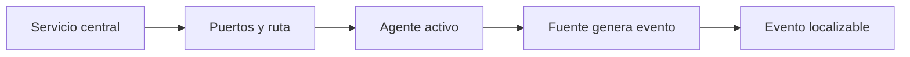

# Pruebas de aceptación del laboratorio

Una instalación no está aceptada porque el dashboard responda. Debe superar cuatro pruebas separadas: servicios, red, agentes y una señal con trazabilidad. El objetivo es saber qué capa falló antes de tocar configuraciones al azar.

## La cadena que vamos a validar



## 1. Servicios y puertos del host central

En el servidor All-in-One:

```bash
sudo systemctl is-active wazuh-manager wazuh-indexer wazuh-dashboard filebeat
sudo ss -tulpn | grep -E ':(1514|1515|55000|9200|443)\b'
```

Resultado esperado: los servicios instalados devuelven `active`; los procesos esperados escuchan solo donde tu topología lo permite. Si el dashboard no responde, no abras primero el firewall: confirma servicio, socket local y después la ruta de red.

## 2. Agentes desde ambos lados

En un agente Linux:

```bash
sudo systemctl is-active wazuh-agent
sudo tail -n 80 /var/ossec/logs/ossec.log
```

En un agente Windows, con PowerShell administrativo:

```powershell
Get-Service -Name WazuhSvc
Get-Content 'C:\Program Files (x86)\ossec-agent\ossec.log' -Tail 80
```

En el manager, busca el agente que acabas de enrolar:

```bash
sudo /var/ossec/bin/agent_control -l | grep -E 'ubuntu-lab-01|win-lab-01'
```

El estado local y el central deben coincidir. Un servicio activo con un agente desconectado es un fallo de comunicación o identidad, no un motivo para cambiar rules.

## 3. Generar una señal controlada

En el agente Linux, solo si ya configuraste la recolección del registro destino, crea una marca única:

```bash
logger -t curso-wazuh 'TRACE_WAZUH_LAB_2026_01 desde 198.51.100.99'
```

Comprueba primero que la marca aparece en el log local correspondiente. Después búscala en el dashboard usando `TRACE_WAZUH_LAB_2026_01`, el nombre del agente y un rango temporal corto. Una alerta no es obligatoria: el resultado correcto para esta prueba es poder demostrar qué ocurre con la señal en cada capa.

| Observación | Qué demuestra | Qué revisar después |
| --- | --- | --- |
| No aparece en el registro local | El generador o la ruta elegida no es la esperada. | Servicio local y archivo de log. |
| Está localmente, no en dashboard | El problema está antes de búsqueda central. | `localfile`, agente, red y manager. |
| Se recibe, sin alerta | La ingesta funciona. | Decoder y rule, si el caso requiere detección. |
| Hay alerta o evento localizable | Cadena de evidencia disponible. | Calidad de campos, filtros y respuesta del caso de uso. |

## 4. Cerrar la aceptación

Registra para el laboratorio: versión del manager y de los agentes, nombres de endpoint, resultado de servicios, prueba de red y el identificador de la señal. No hace falta publicar claves ni archivos de credenciales para que otra persona pueda repetir la validación.

## Matriz de diagnóstico

| Síntoma | Causa probable | Evidencia | Acción | Escalación |
| --- | --- | --- | --- | --- |
| Un servicio central está caído | Recursos o configuración local. | `journalctl -u <servicio> -e --no-pager`. | Corregir la causa indicada y repetir solo esa capa. | Administración de plataforma. |
| Agente no conecta | DNS, firewall, enrolamiento o identidad. | Puertos y `ossec.log`. | Separar 1514 de 1515; no borrar claves sin evidencia. | Red o endpoint. |
| Evento sin alerta | Cobertura de decoder/rule inexistente. | Evento recibido y campos disponibles. | Diseñar y probar la detección en laboratorio. | Detection engineering. |
| Dashboard no encuentra resultados | Tiempo, filtros o indexación. | Consulta con marca, host y ventana corta. | Revisar índice y filtro antes de repetir el evento. | Operación de plataforma. |

## Referencias

- [Quickstart y comprobación de Wazuh](https://documentation.wazuh.com/current/quickstart.html)
- [Gestión de agentes](https://documentation.wazuh.com/current/user-manual/agent/index.html)
- [Recolección de logs](https://documentation.wazuh.com/current/user-manual/capabilities/log-data-collection/index.html)
