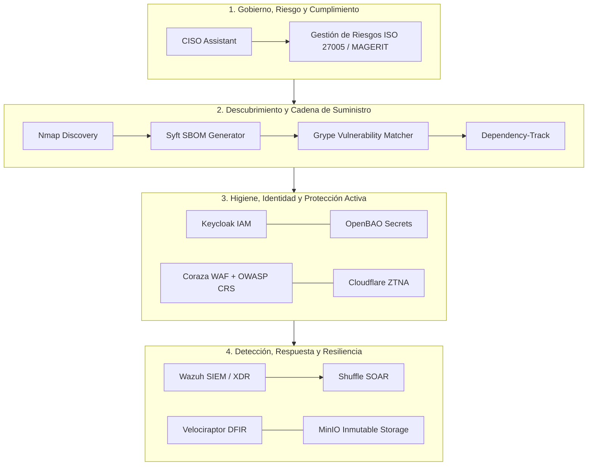

# Arquitectura de Ciberresiliencia para Infraestructuras Críticas y Sector Público

## 1. Contexto y Planteamiento del Problema

Las organizaciones públicas y los operadores de infraestructura crítica enfrentan una asimetría defensiva estructural: entornos tecnológicos heterogéneos, restricciones presupuestarias para licenciamiento privativo y una superficie de ataque ampliada por dependencias externas y software no inventariado (*Shadow IT*).

Este trabajo de fin de máster (TFM) establece una arquitectura de ciberresiliencia integral, fundamentada en tecnologías de código abierto (*open source*) y estructurada bajo marcos de referencia internacionales (**NIST CSF 2.0, ISO/IEC 27001, CIS Controls v8.1** y **NICE Framework**), articulada con la normativa de seguridad digital y protección de datos.



---

## 2. Metodología de Selección Tecnológica (ISO/IEC 25010)

En lugar de una adopción arbitraria de herramientas, se aplicó una **Matriz de Decisión Ponderada** basada en el modelo de calidad de software **ISO/IEC 25010:2023**. Se evaluaron requerimientos funcionales, interoperabilidad, seguridad intrínseca, mantenibilidad comunitaria y licencias de 13 componentes tecnológicos.

| Dominio Operativo | Herramienta Seleccionada | Alternativas Evaluadas | Criterio Determinante de Selección |
| :--- | :--- | :--- | :--- |
| **Gestión GRC** | **CISO Assistant** | Eramba, SimpleRisk | Soporte nativo multi-marco (ISO, NIST, NIS2) y API abierta. |
| **Generación SBOM** | **Syft** | Trivy, cdxgen | Precisión en formato CycloneDX y bajo consumo en pipeline. |
| **Análisis Vulnerabilidades** | **Grype + Dependency-Track** | OWASP Dependency-Check | Correlación continua con bases NVD, EPSS y CISA KEV. |
| **Protección Web (WAF)** | **Coraza WAF (OWASP CRS)** | ModSecurity, BunkerWeb | Motor nativo en Go, compatibilidad Caddy/Nginx sin dependencias legacy. |
| **Gestión de Identidades** | **Keycloak** | Authentik, Casdoor | Madurez OpenID Connect / SAML y granularidad RBAC. |
| **Gestión de Secretos** | **OpenBAO** | HashiCorp Vault (BSL) | Continuidad de código abierto bajo gobernanza de Linux Foundation. |
| **SIEM & XDR** | **Wazuh** | ELK Stack, Graylog | Agente unificado para integridad FIM, telemetría y reglas MITRE ATT&CK. |
| **Automatización SOAR** | **Shuffle** | n8n, Tines | Integración directa con ecosistema open source de ciberdefensa. |
| **Forense Digital (DFIR)** | **Velociraptor** | GRR, Autopsy | Recolección de evidencia en vivo mediante VQL (Velociraptor Query Language). |
| **Almacenamiento Inmutable** | **MinIO** | Ceph, TrueNAS | Implementación de *Object Locking* y retención WORM contra ransomware. |

---

## 3. Evidencia Práctica en Entorno de Validación (PoC)

La arquitectura no quedó en una propuesta teórica. Se implementó y validó experimentalmente a través de dos escenarios de prueba técnica.

### Escenario A: Auditoría de Cadena de Suministro y Triaje Multicriterio

Se desplegó un servicio web Python en el puerto `8080` simulando una aplicación interna desatendida (*Shadow IT*). El flujo de validación ejecutó las siguientes etapas:

1. **Descubrimiento de Red**: `Nmap` identificó la presencia del puerto no catalogado.
2. **Generación de SBOM**: `Syft` inspeccionó el contenedor generando un inventario en estándar **CycloneDX**.
   - Aunque el archivo `requirements.txt` solo declaraba **2 dependencias directas**, `Syft` identificó **26 componentes reales**.
   - El **92.3% (24 de 26 componentes)** correspondían a dependencias transitivas ocultas.
3. **Escaneo de Vulnerabilidades**: `Grype` y `Dependency-Track` identificaron **31 coincidencias de CVE** (9 Altas, 19 Medias, 3 Bajas).
   - De las 9 vulnerabilidades altas, **7 residían en dependencias transitivas**.
4. **Priorización de Riesgo**: En lugar de depender exclusivamente del puntaje CVSS, se aplicó un triaje multicriterio combinando **criticidad del activo + exposición + probabilidad de explotación (EPSS) + CISA SSVC (Stakeholder-Specific Vulnerability Categorization)**, determinando decisiones operativas de mitigación (*Act / Attend / Track*).

```
[Nmap Discovery] ──> [Syft: 26 Componentes] ──> [CycloneDX SBOM]
                             │
                             └──> 92.3% Dependencias Transitivas
                                       │
[Grype / Dep-Track] ──> [31 CVEs Coincidentes] ──> [Triaje SSVC / EPSS] ──> Decisión: Act/Track
```

---

### Escenario B: Detección Activa WAF y Correlación en SIEM

Se simuló un vector de ataque web de tipo *Directory Traversal* dirigido al servidor de aplicaciones:

1. **Intercepción en Borde**: `Coraza WAF` con el conjunto de reglas OWASP Coraza Core Rule Set (CRS) interceptó la petición maliciosa y emitió una respuesta de bloqueo **HTTP 403 Forbidden**.
2. **Ingesta de Telemetría**: El agente de `Wazuh` recolectó en tiempo real los registros de auditoría estructurados del WAF.
3. **Correlación de Seguridad**: El motor de reglas de `Wazuh` clasificó el incidente y lo correlacionó de forma automática con la técnica **MITRE ATT&CK T1190 (Exploit Public-Facing Application)**, activando la alerta correspondiente en la consola de operaciones.

```
[Petición: Directory Traversal] 
       │
       ▼
[Coraza WAF + OWASP CRS] ─── (HTTP 403 Bloqueado)
       │
       ▼ (Audit Log JSON)
[Wazuh SIEM / XDR] ─────── (Regla Correlacionada) ───> [MITRE ATT&CK T1190]
```

---

## 4. Resultados Clave de la Validación Técnica

```
┌─────────────────────────┬─────────────────────────┬─────────────────────────┐
│         92.3%           │         31 CVEs         │       WAF ➔ SIEM        │
│ Dependencias Ocultas    │  Triaje Multicriterio   │  Correlación en Vivo    │
│ Identificadas vía SBOM  │  (CVSS + EPSS + SSVC)   │   MITRE ATT&CK T1190    │
└─────────────────────────┴─────────────────────────┴─────────────────────────┘
```

* **Visibilidad Real de Software**: Se demostró que inspeccionar únicamente las declaraciones de primer nivel deja desprotegido más del 90% del código en ejecución.
* **Reducción de Fatiga de Alertas**: La priorización mediante EPSS y CISA SSVC permitió clasificar qué vulnerabilidades requerían parcheo inmediato frente a aquellas sin vector de explotación disponible.
* **Integración Operativa**: Se validó que componentes open source independientes interoperan eficazmente para formar una cadena de contención y visibilidad forense.

---

## 5. Transferencia Educativa (NICE Framework)

El diseño de la arquitectura se vinculó directamente con la formación técnica universitaria y corporativa, mapeando las capacidades de laboratorio a los roles de trabajo del marco **NICE (NIST SP 800-181)**:

* **Cyber Defense Analyst (PR-CDA-001)**: Análisis de telemetría en Wazuh e investigación de alertas.
* **Vulnerability Assessment Analyst (SP-VAM-001)**: Auditoría de SBOM y triaje de vulnerabilidades.
* **Incident Responder (PR-CIR-001)**: Análisis de contención WAF y preservación forense de evidencia.

---

## 6. Conclusiones

La ciberresiliencia en el sector público e infraestructuras críticas no depende exclusivamente de presupuestos masivos en licencias comerciales, sino de una **arquitectura bien articulada, gobernada por estándares internacionales y validada con métricas objetivas de ingeniería**.
