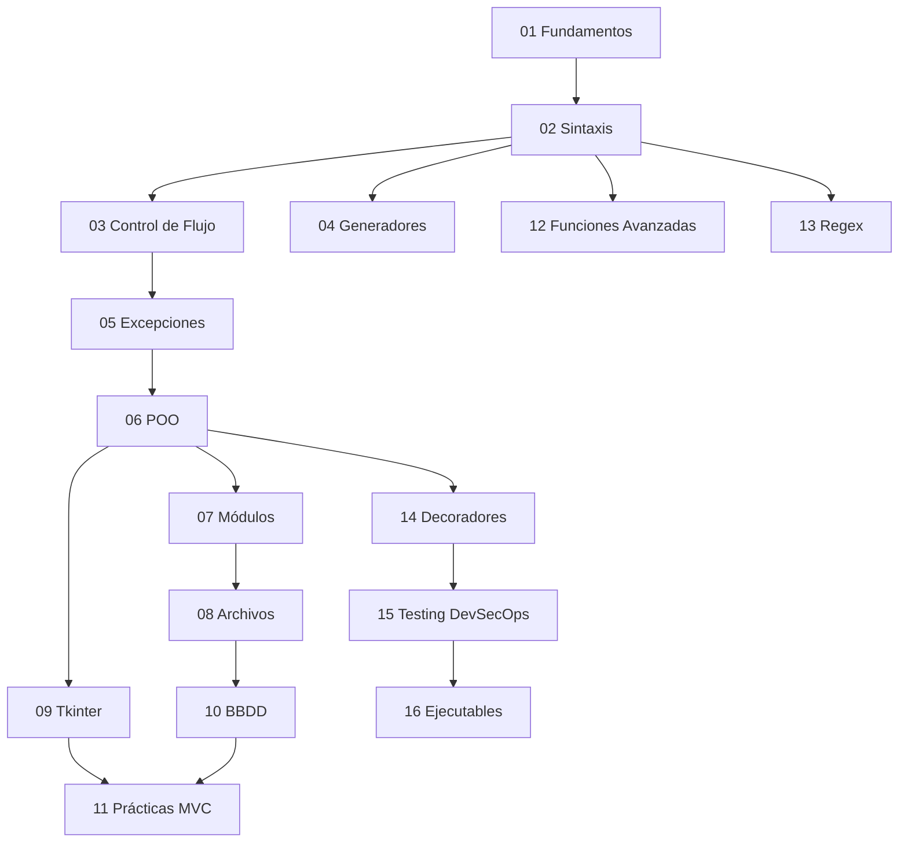

# Índice Maestro — Curso Python desde 0

> **Estándares:** ISO 12207 · ISO 9241 · NIST CSF 2.0 · ENS · RGPD/LOPDGDD
> **Última revisión:** 2026-03-05

---

## Estructura del Manual

Este manual está segmentado en **16 módulos independientes**, cada uno con:

- **Teoría Técnica Avanzada** — El "por qué" de cada decisión de diseño
- **Laboratorio Práctico** — Código funcional listo para producción
- **Ciberseguridad (Blue Team)** — Riesgos específicos y mitigación ENS/NIST
- **Validación Spec-Driven** — Esquemas Pydantic por módulo

---

## Tabla de Contenidos

| #   | Módulo                                                            | Temas Clave                                                     | Archivo                               |
| --- | ----------------------------------------------------------------- | --------------------------------------------------------------- | ------------------------------------- |
| 01  | [Fundamentos e Instalación](./modulo-01-fundamentos.md)           | CPython internals, entornos virtuales, tipado dinámico          | `modulo-01-fundamentos.md`            |
| 02  | [Sintaxis Básica](./modulo-02-sintaxis-basica.md)                 | Tipos, funciones, listas, tuplas, diccionarios, slicing         | `modulo-02-sintaxis-basica.md`        |
| 03  | [Control de Flujo](./modulo-03-control-de-flujo.md)               | Condicionales, `for`, `while`, `break`, `continue`, `pass`      | `modulo-03-control-de-flujo.md`       |
| 04  | [Generadores](./modulo-04-generadores.md)                         | `yield`, lazy evaluation, pipelines ETL, análisis de memoria    | `modulo-04-generadores.md`            |
| 05  | [Excepciones](./modulo-05-excepciones.md)                         | `try/except/else/finally`, jerarquía, inyección de dependencias | `modulo-05-excepciones.md`            |
| 06  | [POO Completa](./modulo-06-poo.md)                                | Clases, herencia, MRO, polimorfismo, ABC, `__slots__`           | `modulo-06-poo.md`                    |
| 07  | [Módulos y Paquetes](./modulo-07-modulos-paquetes.md)             | Sistema de importación, `__init__.py`, paquetes redistribuibles | `modulo-07-modulos-paquetes.md`       |
| 08  | [Archivos y Serialización](./modulo-08-archivos-serializacion.md) | Ficheros, `pickle`, JSON, `pathlib`, path traversal             | `modulo-08-archivos-serializacion.md` |
| 09  | [Interfaces Gráficas Tkinter](./modulo-09-tkinter.md)             | Widgets, MVC en Tkinter, threading seguro                       | `modulo-09-tkinter.md`                |
| 10  | [Bases de Datos SQLite](./modulo-10-bbdd.md)                      | 3NF, UUID v4/v7, Unit of Work, Repository, SQL Injection        | `modulo-10-bbdd.md`                   |
| 11  | [Prácticas Guiadas MVC](./modulo-11-practicas-mvc.md)             | CRUD completo, separación de capas, patrones de integración     | `modulo-11-practicas-mvc.md`          |
| 12  | [Funciones Avanzadas](./modulo-12-funciones-avanzadas.md)         | `lambda`, `filter`, `map`, `reduce`, funcional puro             | `modulo-12-funciones-avanzadas.md`    |
| 13  | [Expresiones Regulares](./modulo-13-regex.md)                     | Metacaracteres, grupos nombrados, ReDoS, validación             | `modulo-13-regex.md`                  |
| 14  | [Decoradores y Validación](./modulo-14-decoradores-pydantic.md)   | `@functools.wraps`, RBAC, Pydantic spec-driven                  | `modulo-14-decoradores-pydantic.md`   |
| 15  | [Documentación y Testing](./modulo-15-testing-devsecops.md)       | `doctest`, `unittest`, pre-commit, `bandit`, `safety`           | `modulo-15-testing-devsecops.md`      |
| 16  | [Ejecutables y Despliegue](./modulo-16-ejecutables.md)            | PyInstaller, firma macOS, distribución                          | `modulo-16-ejecutables.md`            |

---

## Mapa de Dependencias entre Módulos

---

## Sección de Seguridad Transversal

La sección de **GRC (Gobernanza, Riesgo y Cumplimiento)** aplica a todos los módulos:

| Estándar           | Aplicación                                                                 |
| ------------------ | -------------------------------------------------------------------------- |
| **ENS**            | Esquema Nacional de Seguridad — controles de acceso, cifrado, trazabilidad |
| **RGPD/LOPDGDD**   | Privacidad por diseño, minimización de datos, cifrado AES-256              |
| **NIST SP 800-53** | SI-10 (validación entrada), AC-3 (control acceso), SA-11/15 (DevSecOps)    |
| **ISO 12207**      | Ciclo de vida del software, modularidad, contratos de interfaz             |
| **DORA**           | Resiliencia operacional para servicios desplegados                         |

---

## Stack Tecnológico de Referencia

Cuando los ejercicios requieren persistencia o despliegue, se usa:

| Componente             | Herramienta           | Rol                                 |
| ---------------------- | --------------------- | ----------------------------------- |
| **Base de Datos**      | Supabase (PostgreSQL) | Persistencia, autenticación, RLS    |
| **Edge / CDN**         | Cloudflare Workers    | Endpoints, caché, WAF               |
| **Repositorio**        | GitHub                | Versionado, CI/CD, pre-commit hooks |
| **Local (ejercicios)** | SQLite 3.40+          | Prácticas sin dependencias externas |

---

_Manual en cumplimiento de ISO 12207 · ISO 9241 · NIST CSF 2.0 · ENS · RGPD/LOPDGDD_
